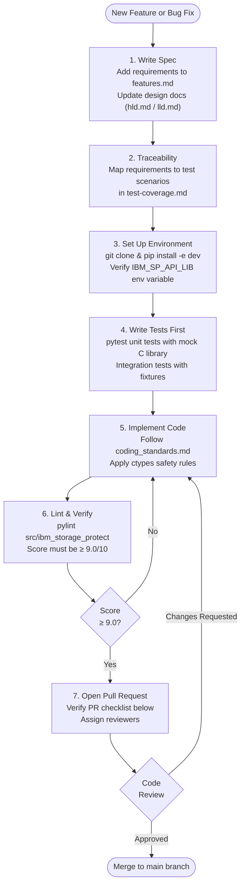

# Contributing to IBM Storage Protect Python SDK

Thank you for your interest in contributing to the IBM Storage Protect Python SDK! This project is open-sourced to build a safe, pythonic wrapper around the native IBM Storage Protect (formerly TSM) C client libraries.

To maintain a secure, robust, and high-performance library, we enforce strict coding guidelines. This directory acts as the central hub for contributor documentation.

---

## 📚 Technical Guidelines

Before writing any code, please review the relevant technical documentation for your changes:

*   **[Coding Standards & C Bindings Safety](coding_standards.md)**: Coding style, project layout, spec-driven development guidelines, dynamic validations, and ctypes memory safety rules (scope anchoring, structure initialization, limits).
*   **[Diagnostics & Troubleshooting Standards](diagnostic_standards.md)**: Standard exception hierarchy, C API to Python mapper configurations, structured logging levels and context correlation parameters, FFDC capture requirements, and platform-specific diagnostics.
*   **[Testing & Verification Standards](testing_standards.md)**: Protocols for writing pytest unit tests with mock objects, developing integration tests with local fixtures, maintaining traceability, and meeting coverage goals.

---

## 📂 Codebase Layout

Understanding where files live will help you locate where to make changes:

```text
src/ibm_storage_protect/
├── c_api_bridge/  # Internal implementation (Hidden from public imports)
│   ├── c_api/              # Low-level ctypes bindings (prototypes, structs, platform_types, load)
│   └── wrappers/           # Python wrappers for C API operations (filespace, object, backup, restore, etc.)
├── base/                   # Abstract base classes and client handle checks
├── control.py              # ControlClient (filespace & object management)
├── enums.py                # Domain-level enums (ObjState, ObjType, etc.)
├── query.py                # QueryClient (queries, lists, class definitions)
├── session.py              # ClientSession (high-level lifecycle)
├── data_client/            # Unified push-based DataClient delegator
├── data_models/            # Type-safe Pydantic v2 schemas and request/response models
├── errors/                 # SDK exceptions hierarchy, mapper registry, error codes
└── logger/                 # Correlation tracking, handler setups, log formatters
```

---

## 🛠️ Contributor Workflow



### 1. Development Prerequisites
Ensure your local development environment has:
*   Python 3.10+
*   The native IBM Storage Protect Client API libraries (`dsmtca64.dll` on Windows, `libApiTSM64.so` on Linux, `libApiTSM64.a` on AIX) installed on your system.
*   Set the `IBM_SP_API_LIB` environment variable to point to the absolute path of your local native library if it is not in the default search path.

### 2. Setting Up Your Environment
Fork the repository, clone it, and set up an editable installation:
```bash
python -m venv .venv
source .venv/bin/activate  # Or .venv\Scripts\activate on Windows
pip install --upgrade pip
pip install -e .[dev]
```

### 3. Code Standards & Linting
We enforce the following code standards:
*   **Style**: PEP 8 compliance.
*   **Typing**: Strict type annotations are required for all public functions, methods, and ctypes helpers.
*   **Pylint**: Pylint execution is mandatory. All modified files must achieve a score of **9.0 / 10.0** or higher.
*   **Formatting**: Use standard formatters.
*   **Complexity**: Keep functions focused. Break down long procedural steps in internal modules into smaller helper functions.

### 4. Pull Request Checklist
Before submitting a PR, verify the following:
- [ ] Your code does not introduce circular dependencies.
- [ ] All new functions and public methods are fully typed.
- [ ] Pylint has been run locally and the code scores 9.0/10.0 or higher.
- [ ] You have run unit and integration tests locally.
- [ ] Code coverage has not decreased.
- [ ] If you modified internal C wrappers, you have verified memory allocation scopes and reference anchoring to prevent memory corruption (see [Coding Standards & C Bindings Safety](coding_standards.md)).
- [ ] No passwords, credentials, or sensitive test data are printed or stored in logs.
