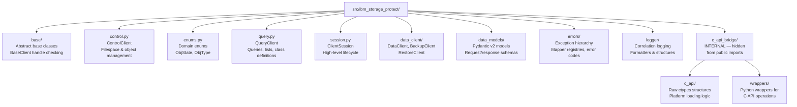
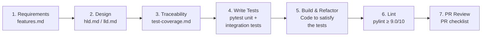
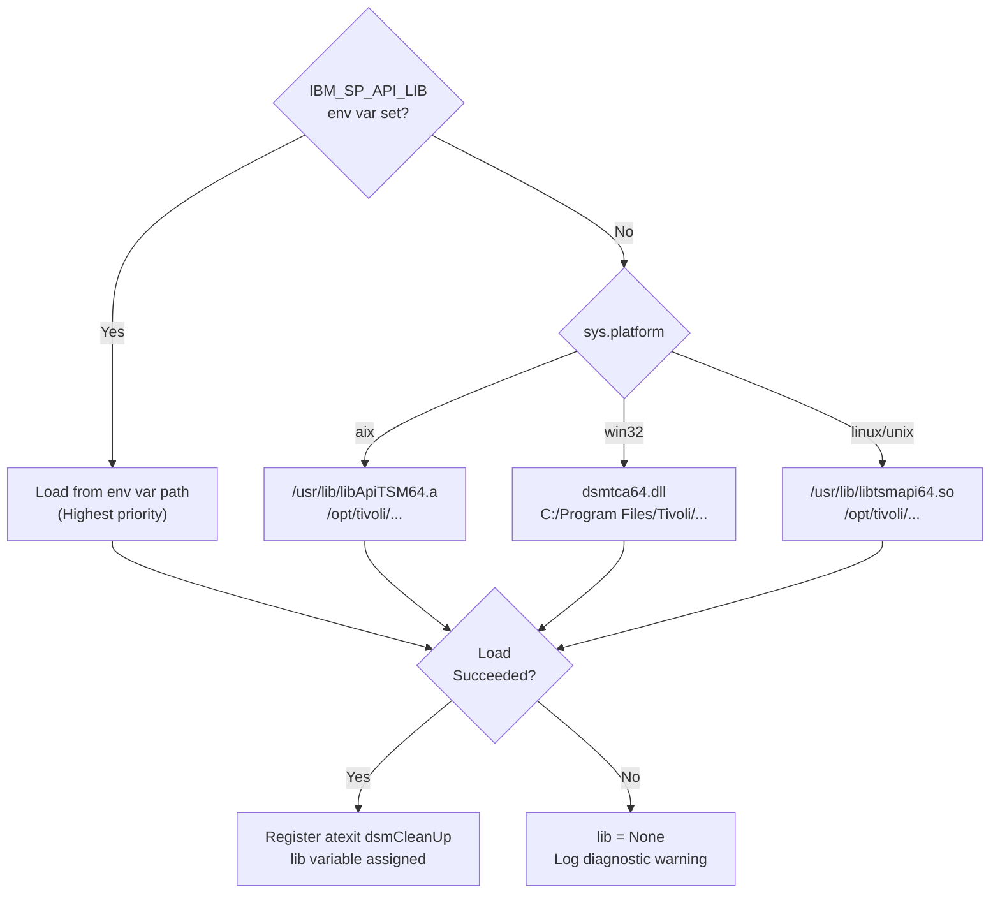

# Coding Standards & Guidelines

This document details the software development practices, directory structure rules, spec-driven development guidelines, and low-level ctypes safety requirements for the IBM Storage Protect Python SDK.

---

## 1. Coding Standards & Practices

### Python Standards
*   **PEP 8**: All Python source code must comply with PEP 8 style guidelines.
*   **Type Annotations**: All public modules, classes, methods, and functions must have complete type signatures.
*   **Pydantic Guard Rails**: Input parameters at the public boundary must be validated using Pydantic (v2) models (defined under `src/ibm_storage_protect/data_models/`). This client-side validation prevents passing invalid types or null values that could cause segmentation faults in the C library.

### Mandatory Linting & Code Analysis
*   **Pylint**: Running `pylint` is a mandatory step for all code modifications.
    *   **Quality Gate**: All modified files and the overall project must maintain a Pylint score of **9.0 / 10.0** or higher. Pull Requests falling below this threshold will fail the CI check.
    *   **Running Pylint locally**:
        ```bash
        pylint src/ibm_storage_protect
        ```
    *   **Rule Overrides**: Avoid inline `# pylint: disable=...` directives unless dealing with platform-specific ctypes castings. All such overrides must be documented with a comment explaining the technical necessity.

### Clean Code Principles
*   **Cohesion**: Keep components focused on a single responsibility.
*   **Delegator Pattern**: The unified entry point [DataClient](../../src/ibm_storage_protect/data_client/client.py) delegator coordinates actions by routing calls to specialized clients (`BackupClient` and `RestoreClient`). Keep operations isolated.
*   **Resource Lifecycle**: Use Context Managers (`with` blocks) via [ClientSession](../../src/ibm_storage_protect/session.py) to manage the C library logins, ensuring connections are closed and server handles are terminated.

---

## 2. Directory Layout & Module Structure

When adding new files, place them in the correct component tier:



---

## 3. Spec-Driven Development Approach

We utilize a **Spec-Driven Development** approach to maintain high quality and structural consistency. Every feature, from design to code:



1.  **Define Requirements**: Write functional and non-functional requirements in [features.md](../requirements/features.md).
2.  **Architectural Layout**: Create design specs in high-level/low-level designs before writing code.
3.  **Traceability Mapping**: Design test scenarios and map them back to the requirements in the [test coverage matrix](../traceability/test-coverage.md).
4.  **Write Tests**: Write pytest unit tests and integration tests before finishing implementation.
5.  **Build and Refactor**: Write code that satisfies the tests, keeping changes focused.

---

## 4. ctypes & C Bindings Safety

Interoperating with native C libraries requires strict memory management. Follow these rules to prevent memory leaks and segmentation faults:

### A. Cross-Platform Library Loading
Native client library paths are resolved dynamically using a strict precedence order. When modifying loading logic in [load.py](../../src/ibm_storage_protect/c_api_bridge/c_api/load.py), ensure the following priority is preserved:



### B. Safe C Structure Initialization
Always zero out the memory buffer of ctypes structures and set their version fields matching native header requirements. Use the `init_struct` helper defined in [helper.py](../../src/ibm_storage_protect/c_api_bridge/wrappers/helper.py):
```python
from ibm_storage_protect.c_api_bridge.wrappers.helper import init_struct
from ibm_storage_protect.c_api_bridge.c_api.structs import dsmApiVersion, dsmApiVersionNum

api_ver = init_struct(dsmApiVersion, dsmApiVersionNum)
# Zeroes out memory using ctypes.memset and assigns stVersion
```

### C. String Scope & Memory Anchoring
Python's garbage collector (GC) runs concurrently and does not track references held inside native C memory. Always assign encoded byte strings to a local variable in the calling function's scope to keep their memory allocation alive.

```python
# ❌ INCORRECT (Segmentation Fault Risk)
login_in.nodeNameP = ctypes.c_char_p("MY_NODE".encode("utf-8"))
lib.dsmInitEx(byref(handle), byref(login_in), ...)

# ✅ CORRECT
node_name_bytes = "MY_NODE".encode("utf-8")
login_in.nodeNameP = ctypes.c_char_p(node_name_bytes)
lib.dsmInitEx(byref(handle), byref(login_in), ...)
```

### D. Reference Anchoring for Nested Arrays
When building structures containing nested pointers (like `dsmGetList` for batch restore or query), return both the parent structure and the child ctypes array to prevent Python from GC'ing the array:

```python
# ✅ CORRECT
def _build_get_list(parts):
    part_count = len(parts)
    partial_arr = (PartialObjData * part_count)()
    for i, part in enumerate(parts):
        partial_arr[i].objId = part.obj_id
        
    get_list = dsmGetList()
    get_list.stVersion = dsmGetListPORVersion
    get_list.numObjects = part_count
    get_list.partialListP = ctypes.cast(partial_arr, ctypes.c_void_p)
    
    return get_list, partial_arr  # Anchor partial_arr by returning it
```

### E. Buffer and Chunk Sizing Limits
*   **Backup Chunks**: Enforce a maximum size limit of **4MB** (`MAX_CHUNK_SIZE`) per chunk sent via `dsmSendData`. If a data chunk exceeds 4MB, raise `TSMDataError` before passing it to ctypes, avoiding buffer overflows.
*   **Restore Buffer**: Streams data using a **1MB** buffer size (`RESTORE_BUFFER_SIZE`) in `dsmGetData` to balance heap utilization.

### F. Multi-threaded Safety
*   **No Handle Sharing**: Do not share a C handle or operational clients (`ControlClient`, `QueryClient`) across separate OS threads.
*   **Per-Thread Sessions**: Each thread must establish its own unique session using `ClientSession` to avoid cross-talk.
