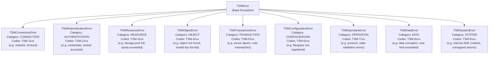
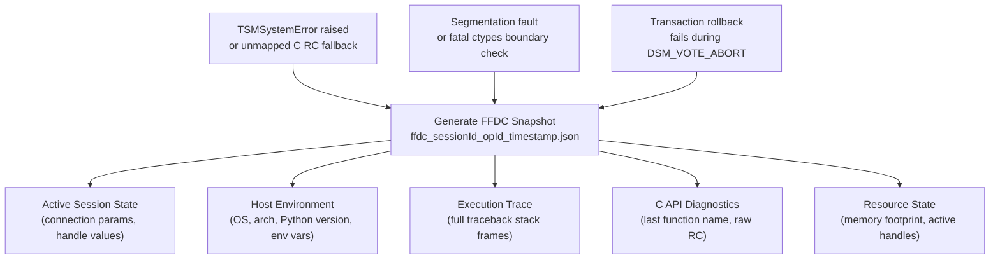

# Diagnostic & Troubleshooting Standards

This document establishes the standards for exception propagation, structured logging, First Failure Data Capture (FFDC), and platform-specific troubleshooting within the IBM Storage Protect Python SDK.

---

## 1. Exception Handling & Error Translation

All custom exceptions must derive from the base class `TSMError`. The category-specific exception classes are organized as follows:



### SDK Error Codes Format (`TSM-CCSS`)
Errors are classified using an 8-character code schema of the form `TSM-CCSS`:
*   **`TSM-`**: Static prefix.
*   **`CC`**: Two-digit Category code (e.g., `11` - Connection, `21` - Authentication, `31` - Resource).
*   **`SS`**: Two-digit Specific error sequence identifier (from `01` to `10`).

### C API to SDK Error Mapping
C return codes (RCs) are resolved in [mapper.py](../../src/ibm_storage_protect/errors/mapper.py) using the internal lookup function `_map_internal_error()`. When mapping a C return code:
1.  **Map specific C codes**: Map exact C return codes to their corresponding `SDKErrorCode` enum value.
2.  **Assign Metadata**: Assign severity (`LOW`, `MEDIUM`, `HIGH`, `CRITICAL`), retry recommendations, and cooldown delays (e.g., `30` seconds for connection errors).
3.  **Preserve C API Message**: Query the native C message details using `dsmRCMsg(handle, rc)` and include it in the Python exception message.
4.  **Fallback Exception**: Default to `TSMSystemError` with standard code `TSM-9105` (`SDKErrorCode.UNEXPECTED_ERROR`) if a return code is unmapped.

### Transaction Recovery & Safe Aborts
Wrap transactional operations in a `try...except` block. If an exception occurs while the transaction is active (`self._txn_active == True`), you must call `lib.dsmEndTxnEx` with the abort vote `DSM_VOTE_ABORT` to roll back the changes on the server:

```python
# ✅ CORRECT TRANSACTION PATTERN
self._txn_active = False
try:
    rc = lib.dsmBeginTxn(self._handle)
    check_rc(self._handle, rc, "dsmBeginTxn")
    self._txn_active = True
    # ... perform object operations ...
    rc = lib.dsmEndTxnEx(self._handle, DSM_VOTE_COMMIT, ...)
    check_rc(self._handle, rc, "dsmEndTxnEx (Commit)")
    self._txn_active = False
except Exception as e:
    if self._txn_active:
        try:
            lib.dsmEndTxnEx(self._handle, DSM_VOTE_ABORT, ...)
        except Exception as cleanup_err:
            logger.error("Transaction abort failed during cleanup", exc_info=cleanup_err)
        finally:
            self._txn_active = False
    raise e
```

---

## 2. Structured Logging Standards

### Canonical Logger Namespaces
*   `ibm_storage_protect.session` (Session lifecycle events: login, logout, refresh)
*   `ibm_storage_protect.data_client` (Backup, restore, and group operations)
*   `ibm_storage_protect.errors` (Error translation and mapper activities)
*   `ibm_storage_protect.c_api` (Low-level ctypes load events and raw return codes)
*   `ibm_storage_protect.audit` (Security-sensitive authentication and permission events)

### Structured Logging Package Layout
The logging capability is modularly organized in the `ibm_storage_protect.logger` package:
*   `logger.config` (`LogConfig`, `configure_logging`): Core log initialization, rotating file setup, and format selection ("json" vs "text").
*   `logger.context` (`set_log_context`, `clear_log_context`, `get_log_context`): Manages thread-local session/operation correlation parameters.
*   `logger.filters` (`SafeExtraFilter`, `ExcludeCApiBridgeFilter`, `IncludeCApiBridgeFilter`): Safety data redactors and low-level bridge logs filters.
*   `logger.formatters` (`StructuredFormatter`, `TextFormatter`): Valid, parsable JSON layouts and ANSI colored text formats.
*   `logger.operations` (`log_operation`): Telemetry tracking context manager wrapper measuring execution times.

### Correlation Identifiers
Log events should propagate standard metadata to simplify log parsing:
*   `session_id`: Unique identifier tracking the lifecycle of an active session connection handle.
*   `operation_id`: Unique UUID generated at the start of a public API operation.
*   `duration_ms`: Duration of the task, calculated using `time.perf_counter()`.
*   `event_type`: Event classification string (e.g., `operation.completed`, `auth.failure`).
*   `error`: Sub-object representation of a mapped exception (`error.to_dict()`).

### Dynamic Logging Level Control
You can dynamically adjust the root logging level and active handlers for the SDK without restarting the process:
*   Call `set_sdk_log_level(level: str)` (e.g. `set_sdk_log_level("DEBUG")`) exported directly from the `ibm_storage_protect.logger` module.

### C API Environmental Tracing (`dsmSetUp`)
For deep diagnostic library layer debugging:
*   Call the package-level `initialize_environment(dsmi_dir, dsmi_config, dsmi_log, log_name, b_service)` function prior to establishing any sessions. This invokes the native `dsmSetUp()` function to configure the process-wide environment and trace files.

### Server Activity Logging (`dsmLogEventEx`)
To send logging statements directly to the Storage Protect server logs:
*   Use `session.log_server_event(message, severity, log_type, app_name, app_msg_id)` on the `ClientSession` object. This wraps `dsmLogEventEx` to securely forward events to the server’s activity/error logs.

### Mock C-API Loader Logs
*   Never write load statuses or mock fallback indicators to stdout using `print()`. Always write loader messages to the NAMESPACED `_logger` system (e.g., using `_logger.info` or `_logger.warning` in `c_api_bridge/c_api/load.py`) to ensure diagnostics are captured inside structured rotating log outputs.

### Redaction Requirements
Never log credentials, encryption keys, tokens, or raw payload contents. Password parameters in login objects must be redacted from logs and exception messages.

### Duplicate Prevention
Log the full stack trace at the public client boundary. Intermediate internal helper wrappers must raise exceptions silently without redundant warning/error log calls.

---

## 3. First Failure Data Capture (FFDC)

When a critical error or system crash occurs, the SDK must capture a complete diagnostic snapshot immediately. This prevents the need to reproduce failures under heavy debug log verbosities.

### FFDC Triggers



### Storage & Serialization
FFDC files are generated in the configured log directory (or current directory) with the filename format:
`ffdc_<session_id>_<operation_id>_<timestamp>.json`

### Captured Diagnostic Parameters
*   **Active Session State**: Connection parameters (excluding passwords), user configuration settings, and library handle values.
*   **Host Environment**: Operating system type, processor architecture, Python version, environment variable states (e.g. `IBM_SP_API_LIB`).
*   **Execution Trace**: Full traceback stack frame dump.
*   **C API Diagnostics**: Last executed C API function name and the raw return code.
*   **Resource State**: Current memory footprint and active handle registry counts.

---

## 4. Platform & OS Specific Diagnostics

Native client wrappers behave differently across host operating systems. Implement diagnostics using platform-specific APIs when debugging bindings:

### Windows (win32)
*   **Dynamic Loading Issues**: If `dsmtca64.dll` fails to load, capture the Windows System Error Code via `ctypes.GetLastError()`. Common errors include `126` (Module not found) or `193` (Not a valid Win32 application, indicating a 32-bit/64-bit mismatch).
*   **Registry Check**: Windows installations often record library paths in the registry. Troubleshooting guides should point administrators to verify Tivoli registry subkeys.

### Linux / Unix (linux, freebsd)
*   **Library Dependency Failures**: If `libtsmapi64.so` fails to load due to missing shared object dependencies, suggest using `ldd` on the library file.
*   **Environment Paths**: Verify if the library search paths (`LD_LIBRARY_PATH`) include the path to the Storage Protect API binaries.

### IBM AIX (aix)
*   **Archive Member Resolution**: AIX loads C libraries from archive containers (`.a` files). Ensure that the platform loader specifies the correct archive object member (e.g. `libApiTSM64.a(shlink.o)`).
*   **Error Logging**: AIX system logs (`errpt`) can record internal client crashes. Instruct administrators to search system logs if connection drops occur without SDK trace output.
