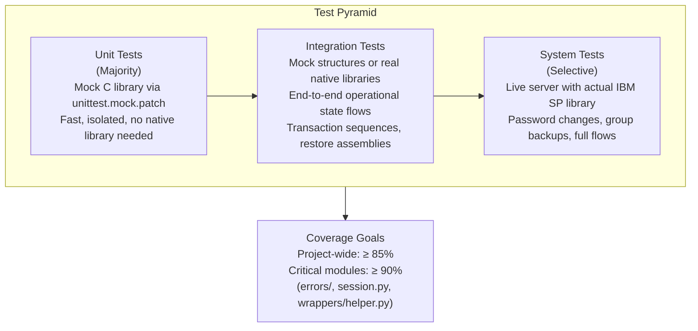
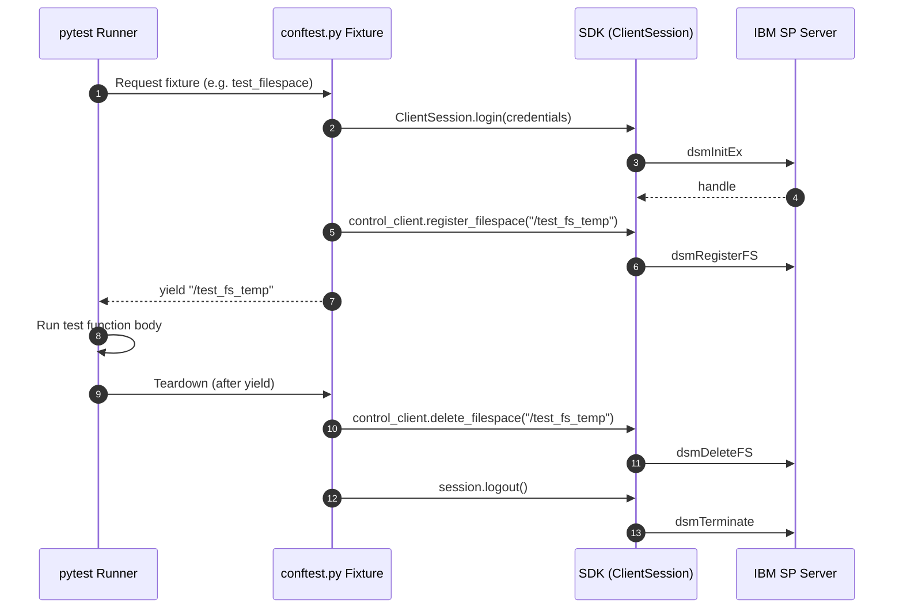
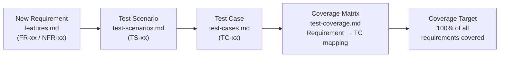

# Testing & Verification Standards

To guarantee safety at the native C boundary and prevent regression, all code changes must be accompanied by comprehensive test coverage. We write unit tests, mock integration tests, and live server integration tests using **`pytest`**.

---

## 0. Testing Strategy Overview



---

## 1. Unit Testing with Mocking

Unit tests must test components in isolation. Because loading the actual native IBM Storage Protect library requires host configurations, **unit tests must never depend on the presence of native C libraries**.

### Mocking C Libraries
The SDK includes a built-in Mock C API (`MockCDLL` and `MockFunction` under `ibm_storage_protect.c_api_bridge.c_api.mock`) that simulates the ctypes signatures of the native library. 

#### 1. Automatic Mock Loading (Unit Testing)
By default, the SDK dynamic loader (`load.py`) automatically detects when tests are running under `pytest` (or when the environment variable `SP_USE_MOCK_C_API` is set to `1` or `true`) and loads the mock C API library instance instead of looking for native shared libraries. This allows running the test suite immediately out-of-the-box on any developer machine or CI pipeline.

#### 2. Switching to Real C API DLLs / Shared Libraries
To bypass the automatic mocking during tests and verify behavior against the real native C client library:
1. Ensure the native libraries are installed (or configure `IBM_SP_API_LIB` to point to your native DLL/SO path).
2. Set the environment variable `SP_USE_MOCK_C_API=0` (or `false`) to force the loader to locate and bind the native libraries.

**Example (PowerShell):**
```powershell
$env:SP_USE_MOCK_C_API="0"
$env:IBM_SP_API_LIB="C:\Program Files\Tivoli\TSM\api\bin64\dsmtca64.dll"
pytest
```

**Example (Linux/macOS):**
```bash
SP_USE_MOCK_C_API=0 IBM_SP_API_LIB=/usr/lib/libtsmapi64.so pytest
```

#### 3. Writing Mocked Test Cases
Since `lib` is imported directly as a mock during test execution, you can directly override mock behaviors:

```python
from ibm_storage_protect.c_api_bridge.c_api.load import lib
from ibm_storage_protect.errors import TSMAuthenticationError

def test_login_expired_password():
    # Mock return code for password expired (52)
    lib.dsmInitEx.side_effect = None
    lib.dsmInitEx.return_value = 52
    
    with pytest.raises(TSMAuthenticationError):
        with ClientSession() as session:
            session.login(LoginCredentials(node="<test-node>", password="<expired-test-password>"))
```

---

## 2. Integration Testing

Integration tests verify end-to-end operational state flows (such as backup transaction sequences or restore stream assemblies) and can utilize mock structures or real native libraries.

### Test Fixture Lifecycle



### Fixtures and Cleanups
Use pytest fixtures in [conftest.py](../../tests/conftest.py) to manage handles, credentials, and temp workspace directories.
Ensure that any resources registered during an integration test (e.g., creating test filespaces or mock objects) are cleanly torn down in a finalizer block:

```python
# ✅ CORRECT FIXTURE PATTERN WITH TEARDOWN
@pytest.fixture
def test_filespace(session_handle):
    fs_name = "/test_fs_temp"
    # Register filespace
    # ...
    yield fs_name
    # Teardown: Delete filespace from server after test completes
    # ...
```

---

## 3. Requirements Traceability

Every functional requirement (FR) and non-functional requirement (NFR) in the repository is mapped to verification scenarios. When contributing a new feature or modification:



1.  **Add feature specs**: Record the new features and requirements inside [requirements/features.md](../requirements/features.md).
2.  **Update Traceability Matrix**: Map your test cases to the requirement IDs in [test-coverage.md](../traceability/test-coverage.md). 
3.  **Document coverage**: Ensure that the target requirements coverage index remains at **100%**.

---

## 4. Test Coverage Standards

We aim to keep codebase health high:
*   **Total Project Coverage**: Must remain above **85%**.
*   **Critical Modules Coverage**: The core error translation layers (`errors/`), session contexts (`session.py`), and ctypes bindings safety helpers (`wrappers/helper.py`) must maintain **>90%** coverage.

---

## 5. Running Tests locally

Use the following commands to execute tests in your local development environment:

### Run the entire test suite
```bash
pytest
```

### Run specific test files
```bash
pytest tests/test_error_handling.py -v
```

### Run specific test functions
```bash
pytest tests/test_client.py::test_backup_single_object -v
```

### Generate a coverage report
```bash
pytest --cov=src/ibm_storage_protect --cov-report=html
# Open htmlcov/index.html in a browser to review coverage metrics
```
