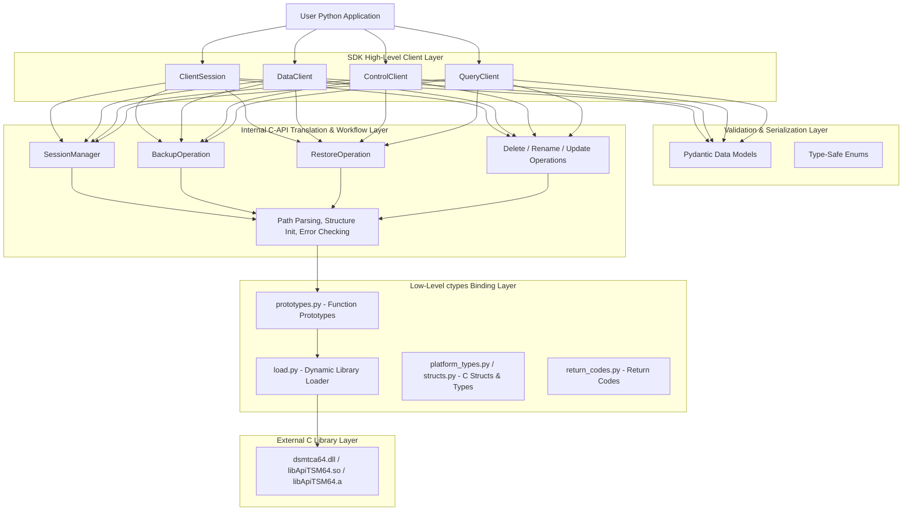
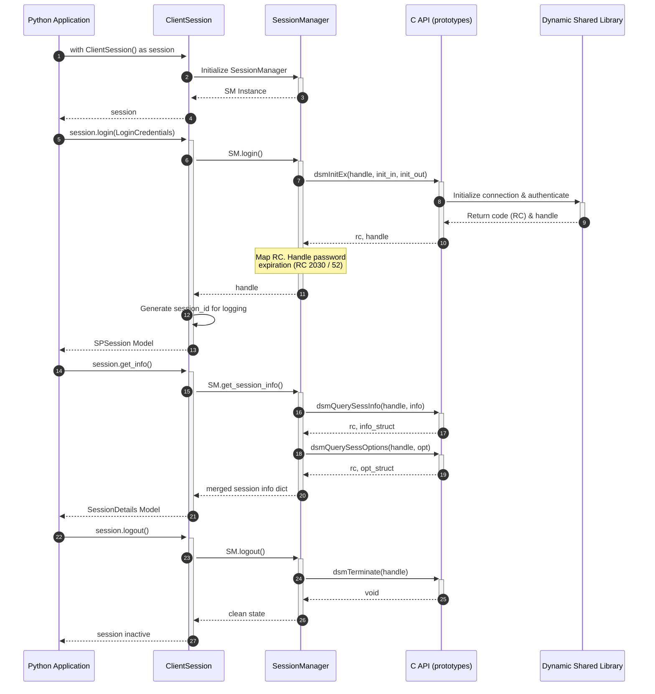
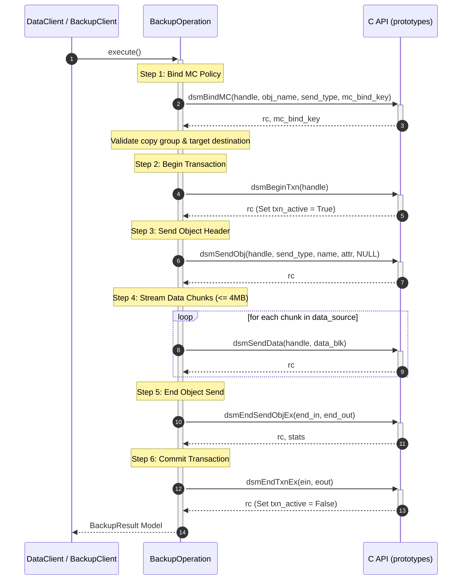
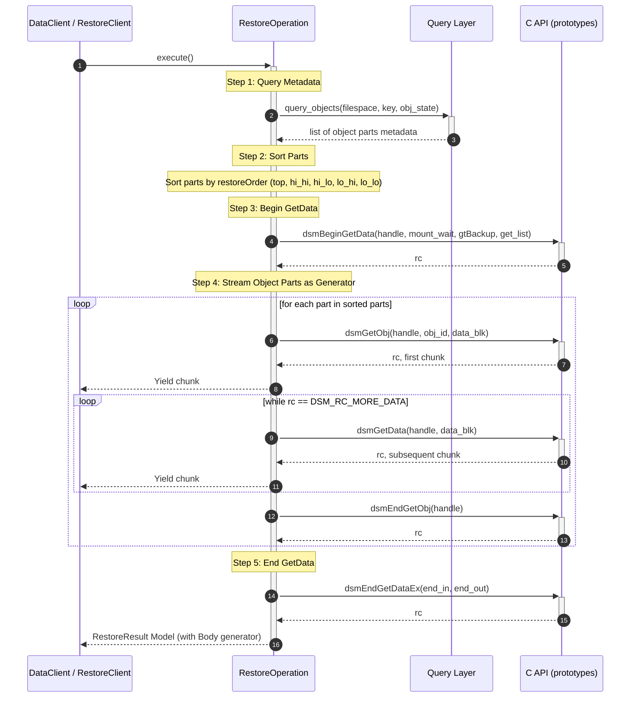
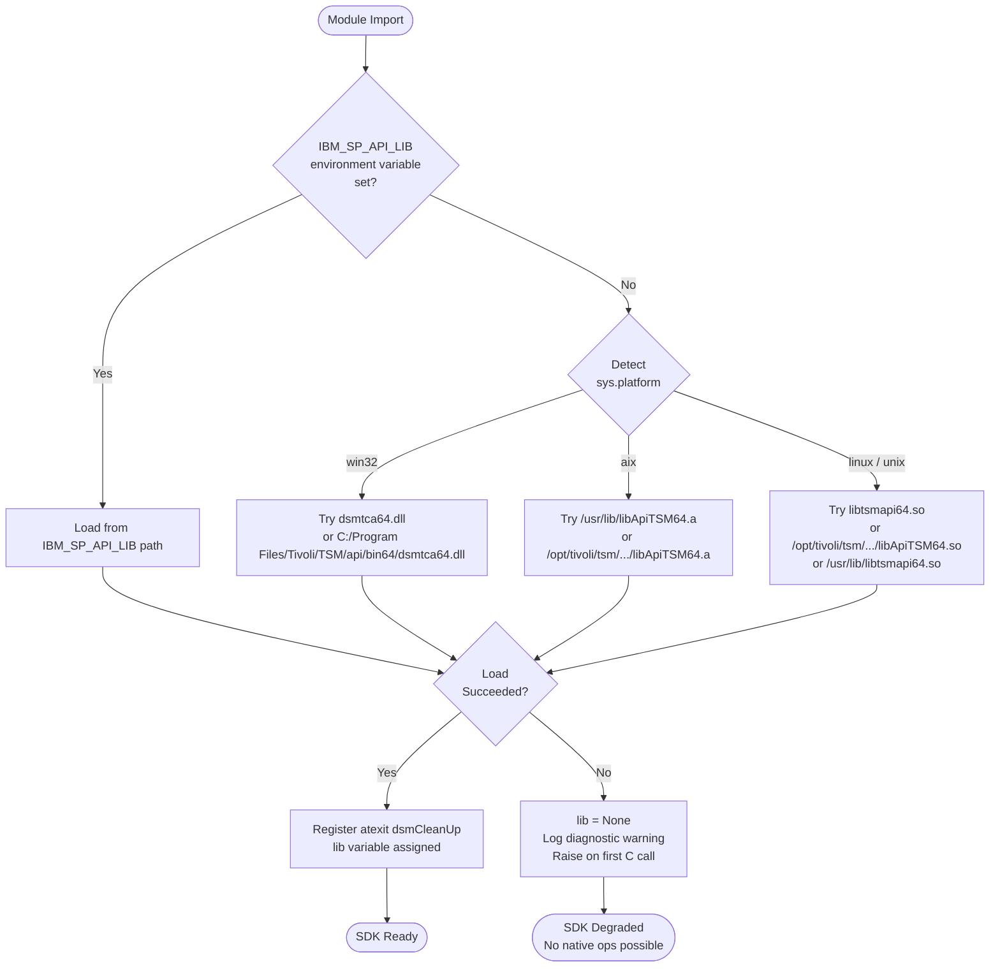

# High-Level Design (HLD): IBM Storage Protect Python SDK

This document provides a high-level architectural overview and design specifications for the Python-based SDK wrapper for IBM Storage Protect (formerly Tivoli Storage Manager / TSM). The SDK bridges modern Python applications with the native IBM Storage Protect C client libraries.

---

## 1. System Context & Architecture

The SDK is structured as a **layered framework** that transitions from user-friendly, type-safe Python abstractions down to raw C memory and system-level dynamic library calls.

### Architectural Layers

1. **High-Level Client Layer**: The primary public-facing API. It exposes object-oriented interfaces (`ClientSession`, `DataClient`, `ControlClient`, `QueryClient`) that hide all transaction handling, paging, chunking, and memory management.
2. **Validation & Serialization Layer**: Utilizes **Pydantic (v2)** models (`data_models/`) and standard enums (`enums/`) to ensure all input arguments are validated client-side before invoking C calls. This prevents segmentation faults by catching invalid types early.
3. **Internal C-API Translation Layer**: Implements core operational workflows (`SessionManager`, `BackupOperation`, `RestoreOperation`, etc.) that translate Python models into low-level C structures and coordinate multi-step API sequences (e.g., binding management classes before starting backup transactions).
4. **Low-Level ctypes Binding Layer**: Directly maps C API signatures, structures, types, and return codes into Python. It uses python's built-in `ctypes` module to dynamically load and interface with the native dynamic link libraries.
5. **Native C Library**: The dynamic shared libraries (`dsmtca64.dll` on Windows, `libApiTSM64.so` on Linux, etc.) provided by the IBM Storage Protect client installer.

---

## 2. Key Design Patterns & Core Decisions

### 2.1. Resource Lifecycle & Context Management
To prevent resource and memory leaks of C handles on the server and client, the SDK implements the **Context Manager Pattern** (`__enter__` and `__exit__`). 
- Active sessions are automatically cleaned up when exiting the context block.
- A global registry clean-up is registered via python's `atexit` module, guaranteeing that `dsmCleanUp` is called with single-threaded execution modes when the python process exits.

### 2.2. Delegator Pattern for Data Client
The `DataClient` provides a single unified entry point for all backup and restore operations to preserve backward compatibility. Internally, it delegates logic to specialized clients (`BackupClient` and `RestoreClient`), enforcing high cohesion and single-responsibility principles.

### 2.3. Transaction-Centric Operations
Backup, delete, and rename operations are intrinsically transaction-based. The SDK wraps these operations using the C API's `dsmBeginTxn` and `dsmEndTxnEx` calls. On failure of any sub-step, it enforces a `DSM_VOTE_ABORT` vote to automatically roll back changes on the server. On success, a `DSM_VOTE_COMMIT` vote is issued.

### 2.4. Error Translation Mapping
Low-level integer return codes (RCs) returned by the C library are translated into python exceptions using a dedicated mapping registry (`errors/mapper.py`). 
- Maps C return codes (e.g., `2021`, `-50`, `137`) to structured python exception types (e.g., `TSMConnectionError`, `TSMAuthenticationError`).
- Injects rich metadata, including:
  - Standardized SDK error codes (e.g., `TSM-1102` for network errors)
  - Severity classification (`LOW`, `MEDIUM`, `HIGH`, `CRITICAL`)
  - Intelligent **retry suggestions** (e.g., indicating whether an error is transient and specifying a recommended cooldown delay).

### 2.5. Structured Logging & Context Correlation
All client layers generate structured, machine-readable logs containing:
- Unique session IDs (`session_id` correlated with the C handle)
- Unique operation IDs (`operation_id`)
- Duration metrics (`duration_ms` calculated using `time.perf_counter()`)
- Granular step events (e.g., `query.list_objects.started`, `c_api.dsmGetObj.call`, `query.list_objects.completed`)

---

## 3. High-Level Data Flows

### 3.1. Session Lifecycle Flow

The session lifecycle manages initialization, options configuration, active status validation, password modification, and graceful termination.

---

### 3.2. Data Backup Flow (Single Object)

Backing up a single object requires binding to a management class policy, beginning a server transaction, sending object headers, streaming data in chunks up to 4MB, ending the object transmission, and committing the transaction.

---

### 3.3. Data Restore Flow (Single Object)

Restoring an object requires query metadata lookup to locate the specific Object IDs, ordering parts sequentially, initiating retrieval, streaming chunks (default 1MB buffer) via a generator, and closing the retrieval session.

---

## 4. Cross-Platform Library Loading Design

Because IBM Storage Protect client binaries are native C libraries, the SDK supports dynamic platform-specific dynamic link library loading via `ctypes.CDLL`. 

### Search Sequence & Path Priority

1. **Environment Variable Override**: If `IBM_SP_API_LIB` is specified, it holds the absolute highest precedence.
2. **Platform Default Paths**:
   - **AIX**: Archive container format (`/usr/lib/libApiTSM64.a`, `/opt/tivoli/tsm/client/api/bin64/libApiTSM64.a`).
   - **Windows**: DLL dynamic library format (`dsmtca64.dll` in working directory or default path `C:\Program Files\Tivoli\TSM\api\bin64\dsmtca64.dll`).
   - **Linux / Unix**: Shared object format (`libtsmapi64.so`, `/opt/tivoli/tsm/client/api/bin64/libApiTSM64.so`, `/usr/lib/libtsmapi64.so`, `/usr/lib64/libtsmapi64.so`).

If loading fails for all possible paths, the library variable `lib` is set to `None`, and diagnostic logs are generated to assist the administrator in installing client dynamic libraries or configuring environment paths.
