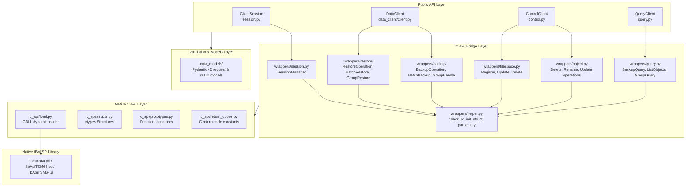
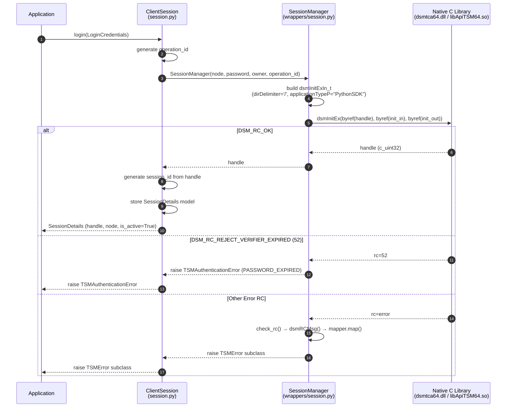
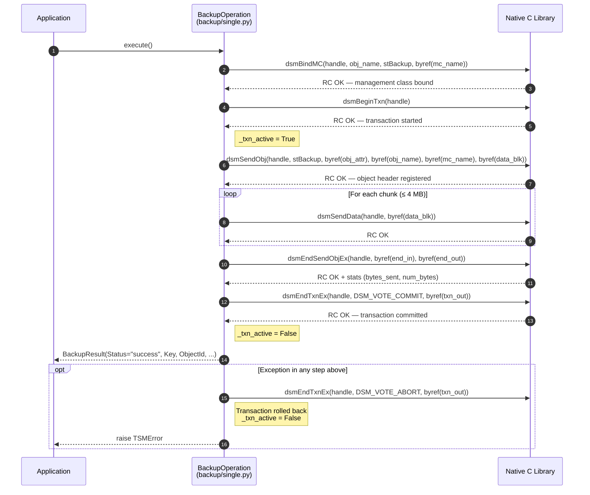
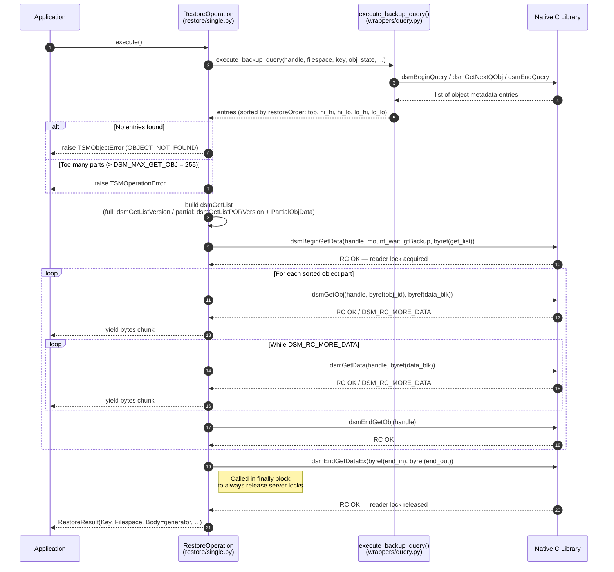
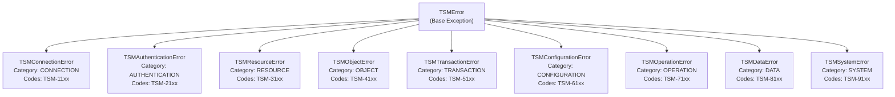
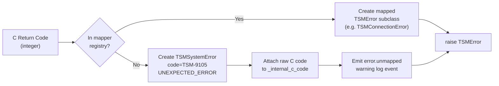

# Low-Level Design (LLD): IBM Storage Protect Python SDK

This document details the low-level components, classes, data structures, error mappings, memory buffer management, and key code sequences for the IBM Storage Protect Python SDK.

---

## 1. Module and File Architecture

The SDK source code is located under `src/ibm_storage_protect` and organized as follows:

```
src/ibm_storage_protect/
├── __init__.py                                 # Core exports (ClientSession, DataClient, etc.)
├── control.py                                  # ControlClient (filespace & object management)
├── enums.py                                    # SDK-level types (ObjState, ObjType, etc.)
├── query.py                                    # QueryClient (queries, lists, class definitions)
├── session.py                                  # ClientSession (high-level lifecycle)
├── base/
│   └── __init__.py                             # BaseClient with handle checking logic
├── data_client/
│   ├── __init__.py
│   ├── client.py                              # DataClient (unified interface delegator)
│   ├── backup.py                              # BackupClient
│   └── restore.py                             # RestoreClient
├── data_models/                                # Pydantic v2 validation models
│   ├── __init__.py
│   ├── backup.py
│   ├── filespace.py
│   ├── object.py
│   ├── query.py
│   ├── restore.py
│   └── session.py
├── errors/
│   ├── __init__.py
│   ├── error_codes.py                         # Standard SDK error codes (TSM-xxxx)
│   ├── exceptions.py                          # Custom hierarchy of Python exceptions
│   └── mapper.py                              # Maps C API return codes to SDK Exceptions
├── logger/
│   ├── __init__.py
│   ├── context.py                             # Log context, session/operation IDs
│   ├── filters.py                             # Logging filters
│   ├── formatters.py                          # Log formatters
│   ├── config.py                              # LogConfig, configure_logging, dynamic levels
│   └── operations.py                          # log_operation context manager
└── c_api_bridge/                               # Intermediate wrappers & low-level bindings
    ├── __init__.py
    ├── c_api/                                 # Direct ctypes bindings to native C library
    │   ├── __init__.py
    │   ├── load.py                            # Dynamic DLL / SO loading logic
    │   ├── platform_types.py                  # ctypes base platform type mappings
    │   ├── prototypes.py                      # ctypes function prototypes
    │   ├── release.py                         # C API resources release
    │   ├── return_codes.py                    # C API return code constants
    │   └── structs.py                         # ctypes structures
    └── wrappers/
        ├── __init__.py
        ├── filespace.py                       # C wrappers for filespace operations
        ├── helper.py                          # ctypes init helpers, encoders, key splitters
        ├── object.py                          # C wrappers for object delete/rename/update
        ├── query.py                           # C wrappers for queries
        ├── session.py                         # SessionManager ctypes coordinator
        ├── backup/
        │   ├── __init__.py
        │   ├── batch.py                       # Batch backup transaction flow
        │   ├── group.py                       # Group backup leader-member flows
        │   └── single.py                      # Single object backup flow
        └── restore/
            ├── __init__.py
            ├── batch.py                       # Batch restore list coordinator
            ├── group.py                       # Group restore coordinator
            └── single.py                      # Single object restore flow (generator-based)
```

### 1.1. Architecture Tiers



---

## 2. Low-Level Component Specifications

### 2.1. Client Layer

#### `BaseClient`
Defined in `base/__init__.py`.
- **Purpose**: Base class for all operational clients (`DataClient`, `ControlClient`, `QueryClient`).
- **Methods**:
  - `__init__(session: ClientSession)`: Validates that the session is active.
  - `_require_handle() -> int`: Returns the raw integer C handle of the session. Raises `ValueError` if the handle is unavailable.

#### `ClientSession`
Defined in `session.py`.
- **Purpose**: Manages high-level connection lifecycle and context scopes.
- **Attributes**:
  - `_session_manager: SessionManager`: Internal wrapper instance.
  - `_session: SPSession`: Model containing session metadata.
  - `_session_id: str`: Formatted session correlation identifier used for logging context.
- **Context Protocol**:
  - `__enter__()`: Returns self.
  - `__exit__(exc_type, exc_val, exc_tb)`: Invokes `logout()`, allowing automatic connection release.

#### `DataClient`
Defined in `data_client/client.py`.
- **Purpose**: Aggregates backup and restore clients.
- **Delegated Targets**:
  - Delegates backup tasks (`backup`, `batch_backup`, `create_group`, `load_group`) to `_backup_client: BackupClient`.
  - Delegates restore tasks (`restore`, `batch_restore`, `group_restore`) to `_restore_client: RestoreClient`.

---

### 2.2. Validation & Serialization Layer (`data_models/`)
Pydantic v2 is used to validate all SDK inputs and serialize outputs:
- **`LoginCredentials`**: Node name, password, owner, proxy node settings.
- **`SessionDetails`**: Serializes server attributes parsed from C struct fields (compression settings, version, host port, limits).
- **`BackupRequest`**: Holds object key, raw payload (generator, bytes, or file stream), management class override, and size estimate.
- **`RestoreRequest`**: Key, target filespace, optional PitDate (Point-in-Time), partial restore offset, and byte length.

---

### 2.3. Low-Level ctypes Binding Layer (`c_api_bridge/c_api/`)

#### Dynamic Loading (`load.py`)
- Resolves dynamic libraries based on `sys.platform`:
  - `win32` -> `dsmtca64.dll`
  - `aix` -> `libApiTSM64.a`
  - Unix/Linux -> `libtsmapi64.so` or `libApiTSM64.so`
- Env Variable `IBM_SP_API_LIB` takes priority. Uses `ctypes.CDLL(path)`.

#### Structure Definitions (`structs.py`)
C structures are mapped to `ctypes.Structure` classes. Important structures include:
- **`dsmObjName`**:
  ```python
  class dsmObjName(ctypes.Structure):
      _fields_ = [
          ("fs", ctypes.c_char * 1024),
          ("hl", ctypes.c_char * 1024),
          ("ll", ctypes.c_char * 1024),
          ("objType", ctypes.c_uint8)
      ]
  ```
- **`ObjAttr`**: Contains sizeEstimate (hi/lo components), pre_compressed status, deduplication flags, owner, and objInfo metadata pointer.
- **`DataBlk`**: Data transfer block containing pointer to buffer (`bufferPtr: c_char_p`) and integer sizes (`bufferLen`, `numBytes`).

---

### 2.4. Translation Layer (`c_api_bridge/wrappers/`)

#### Helper Utilities (`helper.py`)
- **`check_rc(handle: int, rc: int, operation: str)`**: Checks if the C return code equals `DSM_RC_OK` (0). If not, queries the human-readable description via `dsmRCMsg(handle, rc, msg_buf)` and raises the mapped Python exception.
- **`init_struct(struct_type, version)`**: Instantiates a ctypes structure, zeroes out its memory buffer using `memset`, and sets the structure version field (`stVersion`).
- **`parse_key(key: str)`**: Splits a slash-delimited object path into high-level directory and low-level file segments. LL component is returned with a leading slash.

---

## 3. Core Workflows & Code Sequences

### 3.1. Session Login Sequence
The sequence diagram in the HLD is implemented by this low-level workflow:



### 3.2. Single Object Backup Sequence
Managed by `BackupOperation` in `backup/single.py`:



### 3.3. Single Object Restore Sequence
Managed by `RestoreOperation` in `restore/single.py`:



---

## 4. Memory & Buffer Management

### 4.1. Avoidance of Memory Corruption in ctypes
To ensure stable memory access and prevent garbage-collection related segmentation faults:
- **String Allocations**: Text values passed to pointer fields (e.g. `clientNodeNameP`, `mcNameP`) are encoded to UTF-8 bytes and assigned to variables within the caller's scope, ensuring their allocations remain alive throughout the life of the C API call.
- **Reference Anchoring**: The `_build_get_list` helper returns a tuple containing the `dsmGetList` struct and the `partial_arr` ctypes array instance. This reference anchor prevents python from garbage collecting the array while the C function uses its pointer.

### 4.2. Chunk Size Optimization
- **Backup Chunks**: Enforces a maximum size limit of **4MB** (`MAX_CHUNK_SIZE`). If a data chunk exceeds 4MB, the SDK raises `TSMDataError` before passing it to ctypes, avoiding buffer overflows or errors in the native client.
- **Restore Buffers**: Streams data using a **1MB** buffer size. This balances heap utilization in the Python runtime with throughput constraints of network packets.

---

## 5. Error & Exception Mapping Specification

### 5.1. Exception Hierarchy



### 5.2. C Return Code Mapping Table

The static mapper in `errors/mapper.py` implements a lookup registry dictionary to assign C API integer codes to SDK custom exception hierarchies. Below is a subset of the critical mapping rules:

| Raw C Return Code | C Constant String | Target Python Exception Class | SDK Error Code | Retry Recommended | Delay (sec) |
| :--- | :--- | :--- | :--- | :---: | :---: |
| `0` | `DSM_RC_OK` | None (Success) | None | - | - |
| `2021` | `DSM_RC_COMM_ERROR` | `TSMConnectionError` | `TSM-1102` (NETWORK_ERROR) | Yes | 30 |
| `178` | `DSM_RC_TIMEOUT` | `TSMConnectionError` | `TSM-1104` (CONNECTION_TIMEOUT) | Yes | 60 |
| `137` | `DSM_RC_REJECT_INVALID_PWD` | `TSMAuthenticationError` | `TSM-2103` (INVALID_CREDENTIALS) | No | 0 |
| `52` | `DSM_RC_REJECT_VERIFIER_EXPIRED` | `TSMAuthenticationError` | `TSM-2104` (PASSWORD_EXPIRED) | No | 0 |
| `11` | `DSM_RC_NO_RESOURCES` | `TSMResourceError` | `TSM-3101` (STORAGE_FULL) | Yes | 300 |
| `2` | `DSM_RC_ABORT_NO_MATCH` | `TSMObjectError` | `TSM-4101` (OBJECT_NOT_FOUND) | No | 0 |
| `125` | `DSM_RC_ABORT_BY_SERVER` | `TSMTransactionError` | `TSM-5101` (TRANSACTION_ABORTED) | Yes | 30 |
| `2061` | `DSM_RC_FS_NOT_REGED` | `TSMConfigurationError` | `TSM-6104` (FS_NOT_REGISTERED) | No | 0 |
| `2016` | `DSM_RC_INVALID_FSNAME` | `TSMConfigurationError` | `TSM-6101` (INVALID_CONFIGURATION) | No | 0 |

### 5.3. Unmapped Code Fallback


