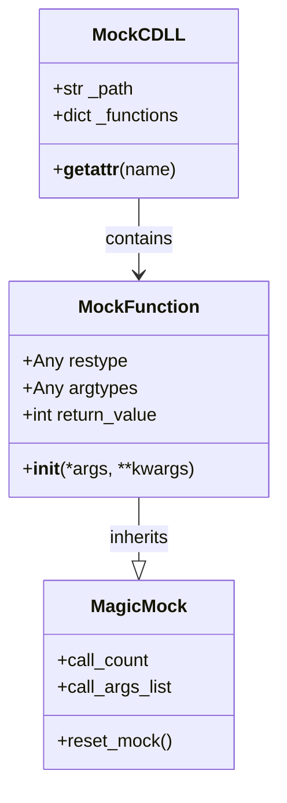
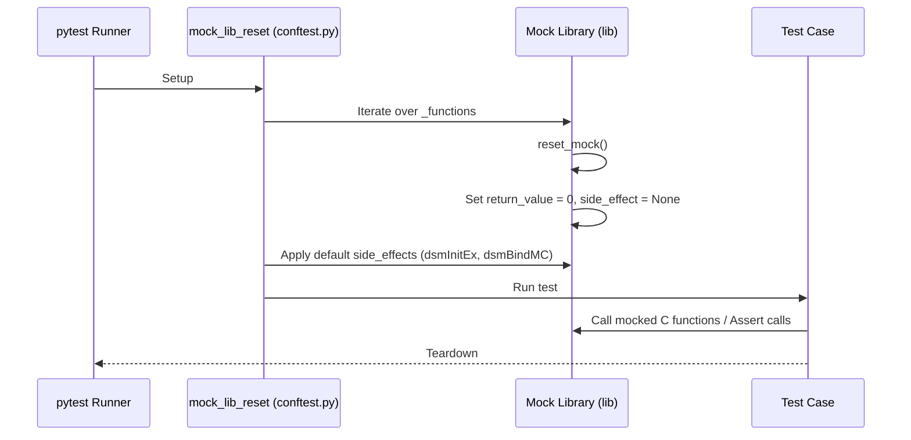

# Mock C API Design Document

This document outlines the design, architecture, and testing patterns for mocking the IBM Storage Protect native C API library (`dsmtca64.dll` on Windows, `libApiTSM64.so` on Linux, `libApiTSM64.a` on AIX) in unit tests using the `pytest` framework.

---

## 1. Rationale and Context

The IBM Storage Protect Python SDK relies on dynamic ctypes bindings to load and invoke functions from the native IBM Storage Protect Client API library (described in the official reference manual [b_api_using.pdf](../reference/b_api_using.pdf)). 

However, developer environments and Continuous Integration (CI) runtimes typically do not have the native client library installed or the required server connectivity. To ensure that tests are **fast**, **hermetic**, and **runnable in any environment**, the C library boundary must be mocked completely.

### Core Goals:
- **Zero Native Dependencies**: Run unit tests successfully without loading a real native shared library or DLL.
- **Realistic C Types Simulation**: Support ctypes attributes like `restype` and `argtypes` since wrapper definitions modify these on the loaded library instance.
- **Clean State Reset**: Ensure mock behavior, return codes, and call counts reset automatically between test executions to avoid state pollution.

---

## 2. Mocking Architecture

The dynamic loader in [load.py](../src/ibm_storage_protect/c_api_bridge/c_api/load.py) performs a search across platform-specific directories using `ctypes.CDLL`. To intercept this, the SDK overrides `ctypes.CDLL` at the start of test execution in [conftest.py](../tests/conftest.py).

### Components of the Mock System



#### 2.1. `MockFunction`
A subclass of `unittest.mock.MagicMock` configured to behave like a ctypes function pointer:
- Exposes `restype` and `argtypes` properties which are set by the bridge prototypes (e.g. `lib.dsmInitEx.restype = dsInt16_t`).
- Defaults to returning `0` (`DSM_RC_OK`), representing C API success.

#### 2.2. `MockCDLL`
A container simulating a loaded `ctypes.CDLL` instance:
- Intercepts requests for attributes (C functions) via `__getattr__`.
- Dynamically spawns and caches a `MockFunction` instance when a function is accessed for the first time.

---

## 3. Test Lifecycle & Reset Mechanics

To guarantee test isolation, a global autouse fixture `mock_lib_reset` runs before every test:



### Default Side Effects Applied on Reset
1. **`dsmInitEx`**: Automatically sets the output parameter `handle_ref` object value to `1` (simulating a valid session handle) and returns `0` (Success).
2. **`dsmBindMC`**: Automatically sets the output parameter `mc_bind_key_ptr.backup_cg_exists` to `1` and `backup_copy_dest` to `b"DISK"` to satisfy management class validation checks.

---

## 4. Writing Unit Tests with the Mock API

When writing unit tests, you directly modify the behavior of C functions via the imported `lib` mock.

### Pattern 1: Simulating Error Return Codes
To test error handling, set the return value of the target C function. The SDK's translation layer will map it to the corresponding Python exception.

```python
from ibm_storage_protect.c_api_bridge.c_api.load import lib
from ibm_storage_protect.errors import TSMAuthenticationError

def test_login_failed_password_expired():
    # Arrange: Set dsmInitEx to return password expired code (52)
    lib.dsmInitEx.side_effect = None
    lib.dsmInitEx.return_value = 52  # DSM_RC_REJECT_VERIFIER_EXPIRED

    # Act & Assert
    with pytest.raises(TSMAuthenticationError):
        session.login(credentials)
```

### Pattern 2: Mocking Out-Parameters (Pointers / C Struct Mutation)
Many C API functions write results to pointers passed by the caller. To mock these, assign a custom `side_effect` function that modifies the pointed-to object.

```python
from ibm_storage_protect.c_api_bridge.c_api.load import lib

def test_query_session_info():
    # Arrange: Define custom side effect to populate ApiSessInfo struct
    def mock_query_sess_info(handle, sess_info_ptr):
        info = sess_info_ptr.contents
        info.adsmServerName = b"TEST_SERVER"
        info.serverPort = 1500
        return 0  # DSM_RC_OK

    lib.dsmQuerySessInfo.side_effect = mock_query_sess_info

    # Act
    info = session.get_session_info()

    # Assert
    assert info["serverName"] == "TEST_SERVER"
    assert info["serverPort"] == 1500
```

### Pattern 3: Verifying Call Counts and Arguments
Validate that wrapper operations invoke the C API functions with correct arguments:

```python
def test_logout_terminates_session():
    # Act
    session.logout()

    # Assert: Verify dsmTerminate was called exactly once
    assert lib.dsmTerminate.call_count == 1
    # Verify the argument was the active session handle (e.g. 1)
    lib.dsmTerminate.assert_called_once_with(1)
```

---

## 5. References
- **IBM Storage Protect Client API Guide**: [b_api_using.pdf](../reference/b_api_using.pdf)
- **SDK LLD Document**: [lld.md](lld.md)
- **Testing Standard**: [testing_standards.md](../contrib/testing_standards.md)
