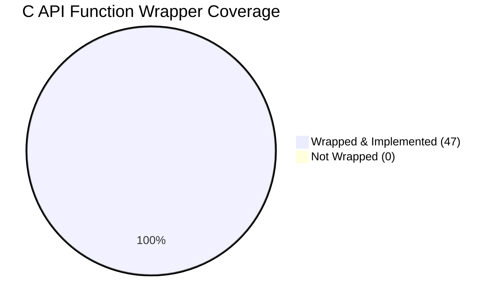

# C API Comparison and Coverage Specification: Python SDK vs. Native C API

This document provides a comprehensive comparison and coverage analysis of the IBM Storage Protect C API functions documented in the official reference manual ([b_api_using.pdf](../reference/b_api_using.pdf)) versus the C API wrapper bridge implemented in the Python SDK ([src/ibm_storage_protect/c_api_bridge/c_api](../../src/ibm_storage_protect/c_api_bridge/c_api/)).

---

## 1. Executive Summary

The IBM Storage Protect Python SDK utilizes a dynamic `ctypes` translation bridge to interface with the native IBM Storage Protect client shared library (`dsmtca64.dll` on Windows, `libApiTSM64.so` on Linux, etc.). 

A comprehensive review of the 266-page native client API reference guide ([b_api_using.pdf](../reference/b_api_using.pdf)) was performed using automated extraction tools. The review identified **47 distinct native C API functions** officially documented for client integration. 

All **47 native C API functions** are declared with full type signatures, argument arrays, and return bindings in the SDK. This represents **100% coverage** at the C bridge layer.

---

## 2. API Elements Coverage Metrics

In addition to function wrappers, the SDK maps the native structures, union types, and error codes defined in the C header files (`dsmapitd.h`, `dsmapidef.h`, `release.h`):

| API Component Type | Documented in Reference PDF | Implemented in SDK (`c_api/`) | Coverage | SDK Source Location |
| :--- | :---: | :---: | :---: | :--- |
| **C API Functions** | 47 | 47 | **100.0%** | [prototypes.py](../../src/ibm_storage_protect/c_api_bridge/c_api/prototypes.py) |
| **Data Structures** | ~67 | 67 | **100.0%** | [structs.py](../../src/ibm_storage_protect/c_api_bridge/c_api/structs.py) |
| **Union Types** | 2 | 2 | **100.0%** | [structs.py](../../src/ibm_storage_protect/c_api_bridge/c_api/structs.py) |
| **Return Codes** | ~429 | 429 | **100.0%** | [return_codes.py](../../src/ibm_storage_protect/c_api_bridge/c_api/return_codes.py) |
| **Platform Types** | All base types | 28 types mapped | **100.0%** | [platform_types.py](../../src/ibm_storage_protect/c_api_bridge/c_api/platform_types.py) |

---

## 3. Detailed Function Coverage Matrix

The following matrix maps every documented C API function from `b_api_using.pdf` to its equivalent `ctypes` prototype definition in `c_api/prototypes.py` and its functional usage category:

| # | C API Function | Documented Function Description | SDK Wrapper Status | Category |
| :-: | :--- | :--- | :---: | :--- |
| 1 | `dsmInit` | Initialize a session (basic params) | ✅ Implemented | Session Management |
| 2 | `dsmInitEx` | Initialize a session with extended options | ✅ Implemented | Session Management |
| 3 | `dsmTerminate` | Terminate session & release server resources | ✅ Implemented | Session Management |
| 4 | `dsmQuerySessInfo` | Query session information (server, port, etc.) | ✅ Implemented | Session Management |
| 5 | `dsmQuerySessOptions` | Query options established for current session | ✅ Implemented | Session Management |
| 6 | `dsmChangePW` | Change client node password on the server | ✅ Implemented | Session Management |
| 7 | `dsmSetUp` | Perform environment setup override after load | ✅ Implemented | Session Management |
| 8 | `dsmCleanUp` | Perform process environment cleanup before exit | ✅ Implemented | Session Management |
| 9 | `dsmBeginTxn` | Start a transaction group for data operations | ✅ Implemented | Transaction Control |
| 10 | `dsmEndTxn` | End a transaction group (basic version) | ✅ Implemented | Transaction Control |
| 11 | `dsmEndTxnEx` | End a transaction group with extended statistics | ✅ Implemented | Transaction Control |
| 12 | `dsmRegisterFS` | Register a filespace logical container on server | ✅ Implemented | Filespace & Metadata |
| 13 | `dsmUpdateFS` | Update registered filespace attributes | ✅ Implemented | Filespace & Metadata |
| 14 | `dsmDeleteFS` | Delete registered filespace and all its data | ✅ Implemented | Filespace & Metadata |
| 15 | `dsmBindMC` | Bind an object to a management class policy | ✅ Implemented | Data Backup / Send |
| 16 | `dsmSendObj` | Send object metadata to initiate backup/archive | ✅ Implemented | Data Backup / Send |
| 17 | `dsmSendData` | Stream a chunk of backup data to the server | ✅ Implemented | Data Backup / Send |
| 18 | `dsmEndSendObj` | Conclude sending a single object (basic version) | ✅ Implemented | Data Backup / Send |
| 19 | `dsmEndSendObjEx` | Conclude sending object with details/stats | ✅ Implemented | Data Backup / Send |
| 20 | `dsmUpdateObj` | Update metadata on a backed-up object | ✅ Implemented | Data Backup / Send |
| 21 | `dsmUpdateObjEx` | Update metadata of object with details/stats | ✅ Implemented | Data Backup / Send |
| 22 | `dsmBeginGetData` | Initiate a restore/retrieve session for objects | ✅ Implemented | Data Restore / Get |
| 23 | `dsmGetObj` | Initiate transfer of a specific object | ✅ Implemented | Data Restore / Get |
| 24 | `dsmGetData` | Stream a chunk of restore data from the server | ✅ Implemented | Data Restore / Get |
| 25 | `dsmEndGetObj` | Conclude receiving a single object | ✅ Implemented | Data Restore / Get |
| 26 | `dsmEndGetData` | Conclude the restore/retrieve data session | ✅ Implemented | Data Restore / Get |
| 27 | `dsmEndGetDataEx` | Conclude restore session and retrieve stats | ✅ Implemented | Data Restore / Get |
| 28 | `dsmBeginQuery` | Initiate search query (backups, filespaces, etc.)| ✅ Implemented | Query Management |
| 29 | `dsmGetNextQObj` | Retrieve next object match from active query | ✅ Implemented | Query Management |
| 30 | `dsmEndQuery` | Conclude active query operation | ✅ Implemented | Query Management |
| 31 | `dsmDeleteObj` | Delete/inactivate backed-up or archived object | ✅ Implemented | Object Operations |
| 32 | `dsmRenameObj` | Rename an existing object on the server | ✅ Implemented | Object Operations |
| 33 | `dsmGroupHandler` | Manage backup group leader/member actions | ✅ Implemented | Group Operations |
| 34 | `dsmSetAccess` | Grant access permissions on objects to other nodes| ✅ Implemented | Access & Security |
| 35 | `dsmQueryAccess` | Query access rules established for the node | ✅ Implemented | Access & Security |
| 36 | `dsmDeleteAccess` | Revoke a cross-node access authorization rule | ✅ Implemented | Access & Security |
| 37 | `dsmQueryCliOptions` | Query options file values prior to starting session| ✅ Implemented | Environment & Options |
| 38 | `dsmQueryApiVersion` | Query compiled version details of native API | ✅ Implemented | Environment & Options |
| 39 | `dsmQueryApiVersionEx` | Query extended compiled version details of API | ✅ Implemented | Environment & Options |
| 40 | `dsmRequestBuffer` | Request zero-copy memory buffer from client API | ✅ Implemented | Managed Buffer API |
| 41 | `dsmReleaseBuffer` | Release allocated memory buffer back to API | ✅ Implemented | Managed Buffer API |
| 42 | `dsmSendBufferData` | Send data stored in a requested zero-copy buffer | ✅ Implemented | Managed Buffer API |
| 43 | `dsmGetBufferData` | Retrieve data directly into zero-copy buffers | ✅ Implemented | Managed Buffer API |
| 44 | `dsmRetentionEvent` | Trigger retention event / compliance hold on object| ✅ Implemented | Retention & holds |
| 45 | `dsmLogEvent` | Write text message to server activity log | ✅ Implemented | Logging & Diagnostics|
| 46 | `dsmLogEventEx` | Write structured message to server log with details| ✅ Implemented | Logging & Diagnostics|
| 47 | `dsmRCMsg` | Convert numeric API return code to text message | ✅ Implemented | Logging & Diagnostics|

---

## 4. Key Architectural Insights & SDK Support

While all C API bindings are fully declared in the lower bridge (`c_api/`), the Python SDK wraps them into various high-level modules with different levels of exposure to the end user:

1. **Session & Security wrappers (`session.py` / `wrappers/session.py`)**:
   - Directly maps `dsmInitEx`, `dsmTerminate`, `dsmChangePW`, `dsmQuerySessInfo`, and `dsmQuerySessOptions`.
   - Utilizes `dsmCleanUp` as a process termination hook registered via Python's `atexit` module.

2. **Backup/Restore Core (`data_client/` / `wrappers/backup/` & `wrappers/restore/`)**:
   - Standard data streaming operations wrap `dsmBeginTxn`, `dsmEndTxnEx`, `dsmBindMC`, `dsmSendObj`, `dsmSendData`, `dsmEndSendObjEx`, `dsmBeginGetData`, `dsmGetObj`, `dsmGetData`, `dsmEndGetObj`, and `dsmEndGetDataEx`.
   - Complex group backups are managed through structural mapping of `dsmGroupHandler`.

3. **Administration & Control (`control.py` / `wrappers/object.py` / `wrappers/filespace.py`)**:
   - Manages logical filespace lifetimes and object attributes via `dsmRegisterFS`, `dsmUpdateFS`, `dsmDeleteFS`, `dsmDeleteObj`, `dsmRenameObj`, and `dsmUpdateObjEx`.

### ⚠️ Functional Gaps at High-Level Python Layers
Although the C functions are successfully bound to Python via ctypes, the SDK has not yet exposed high-level Python interfaces for several advanced functions. Refer to the [Feature Gap Analysis](../traceability/feature-coverage.md) for full context on these high-level gaps, including:
- **Managed Buffer API** (`dsmRequestBuffer`, `dsmReleaseBuffer`, `dsmSendBufferData`, `dsmGetBufferData`)
- **Access Control Sharing** (`dsmSetAccess`, `dsmQueryAccess`, `dsmDeleteAccess`)
- **Compliance Retention Holds** (`dsmRetentionEvent`)
- **Remote Activity Logging** (`dsmLogEvent`, `dsmLogEventEx`)
- **Pre-Session Option Queries** (`dsmQueryCliOptions`, `dsmQueryApiVersion`, `dsmQueryApiVersionEx`)
