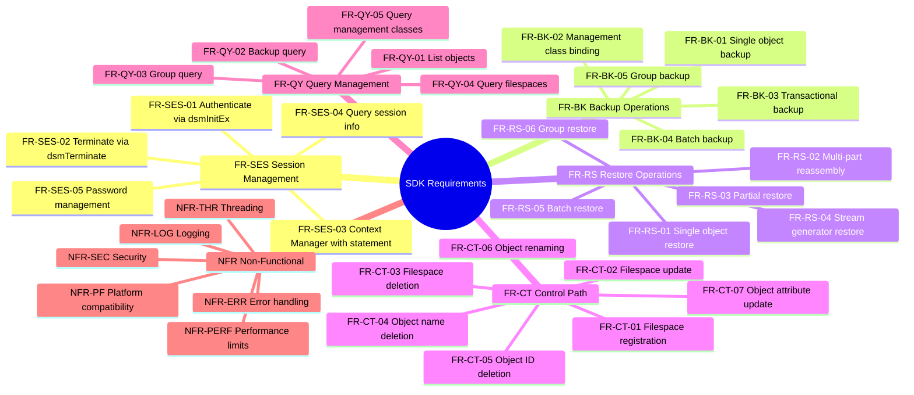

# Functional and Non-Functional Requirements Specification: IBM Storage Protect Python SDK

This document specifies the reverse-engineered functional and non-functional requirements for the Python-based SDK wrapper for IBM Storage Protect, derived from the codebase and design documentation.

---

## Requirements Overview

---

## 1. Functional Requirements (FR)

### 1.1. Session Management (FR-SES)
- **FR-SES-01 (Session Initialization)**: The SDK must authenticate and establish an active connection with the IBM Storage Protect server via the native `dsmInitEx` function using node name, password, owner credentials, and optional proxy node parameters.
- **FR-SES-02 (Session Termination)**: The SDK must terminate active sessions and release server-side resources via `dsmTerminate`.
- **FR-SES-03 (Session Context Manager)**: The SDK must support Python's context manager protocol (`with` statement) to guarantee automatic logout when exiting a context scope, regardless of errors.
- **FR-SES-04 (Session Information Retrieval)**: The SDK must retrieve configuration and capability settings (e.g., compression, LAN-free status, delimiters, and versions) by querying both `dsmQuerySessInfo` and `dsmQuerySessOptions` and merging the results.
- **FR-SES-05 (Password Management)**: The SDK must support changing node passwords on the server via `dsmChangePW`.

### 1.2. Data Backup Operations (FR-BK)
- **FR-BK-01 (Single Object Backup)**: The SDK must support backing up individual objects by sending object headers and streaming their data payloads to the server.
- **FR-BK-02 (Management Class Policy Binding)**: Prior to sending data, the SDK must bind the object to a management class policy using `dsmBindMC` and validate the existence of a backup copy group and copy destination.
- **FR-BK-03 (Transactional Backup)**: The SDK must coordinate backups inside C API transactions (`dsmBeginTxn` / `dsmEndTxnEx`). It must commit the transaction on success (`DSM_VOTE_COMMIT`) and automatically abort it on failure (`DSM_VOTE_ABORT`).
- **FR-BK-04 (Batch Backup)**: The SDK must support backing up multiple objects in batch under optimized transactions.
- **FR-BK-05 (Group Backup)**: The SDK must support creating group backups consisting of a group leader object and multiple member objects using `dsmGroupHandler`.

### 1.3. Data Restore Operations (FR-RS)
- **FR-RS-01 (Single Object Restore)**: The SDK must restore a single backed-up object by querying for the object, initiating data retrieval via `dsmBeginGetData`, and streaming its content.
- **FR-RS-02 (Multi-Part Reassembly)**: For objects split across multiple parts on the server, the SDK must automatically query all parts, sort them sequentially by their `restoreOrder` metadata, and retrieve them in order.
- **FR-RS-03 (Partial Restore)**: The SDK must support retrieving subsets of objects by defining byte offsets and lengths using `dsmGetList` with version `dsmGetListPORVersion`.
- **FR-RS-04 (Stream Generator Restore)**: The SDK must return the restored object payload as a Python generator that yields data chunks dynamically, preventing high RAM overhead.
- **FR-RS-05 (Batch Restore)**: The SDK must support restoring multiple objects in a single batch operation.
- **FR-RS-06 (Group Restore)**: The SDK must support restoring all leader and member objects of a group backup atomically.

### 1.4. Control Path & Metadata Management (FR-CT)
- **FR-CT-01 (Filespace Registration)**: The SDK must register logical filespace containers on the server via `dsmRegisterFS`. This operation must be idempotent.
- **FR-CT-02 (Filespace Update)**: The SDK must allow selective updates to filespace attributes (occupancy, capacity, type, and description) via `dsmUpdateFS` using action flags.
- **FR-CT-03 (Filespace Deletion)**: The SDK must support permanently deleting filespaces and all contained backup and archive objects from all repositories via `dsmDeleteFS`.
- **FR-CT-04 (Object Name Deletion)**: The SDK must support deleting individual objects using their filespace, high-level, and low-level names via `dsmDeleteObj` wrapped in a transaction.
- **FR-CT-05 (Object ID Deletion)**: The SDK must support deleting objects by their unique server-assigned Object IDs (hi/lo pair) via `dsmDeleteObj` wrapped in a transaction.
- **FR-CT-06 (Object Renaming)**: The SDK must support renaming backed-up objects (HL and/or LL names) on the server via `dsmRenameObj` with support for merging versions.
- **FR-CT-07 (Object Attribute Update)**: The SDK must support updating object attributes (owner, management class) via `dsmUpdateObjEx`.

### 1.5. Query Management (FR-QY)
- **FR-QY-01 (List Objects)**: The SDK must support listing backed-up objects within a filespace matching a prefix pattern with pagination limits (`MaxKeys`).
- **FR-QY-02 (Backup Query)**: The SDK must query backed-up objects matching filespace and key patterns, with filters for object state (active/inactive), type (file/directory), Point-in-Time date (`PitDate`), and owner.
- **FR-QY-03 (Group Query)**: The SDK must query group backup member metadata using the group leader's Object ID.
- **FR-QY-04 (Query Filespaces)**: The SDK must query filespace information and statistics registered on the server using pattern matching.
- **FR-QY-05 (Query Management Classes)**: The SDK must query policy domain management classes defined on the server.

---

## 2. Non-Functional Requirements (NFR)

### 2.1. Compatibility & Platforms (NFR-PF)
- **NFR-PF-01 (Runtime Environment)**: The SDK must support Python 3.9 or higher.
- **NFR-PF-02 (Cross-Platform Support)**: The low-level bindings must support loading native C libraries on Windows (`dsmtca64.dll`), Linux/Unix (`libtsmapi64.so` / `libApiTSM64.so`), and AIX (`libApiTSM64.a`).
- **NFR-PF-03 (Precedence of Library Loading)**: The library loader must check the `IBM_SP_API_LIB` environment variable first, then platform-specific folders, and finally the working directory.
- **NFR-PF-04 (Automatic Global Cleanup)**: The SDK must register a global clean-up hook using `atexit.register(lib.dsmCleanUp)` with `DSM_SINGLETHREAD` mode to free global C API memory allocations on process exit.

### 2.2. Performance & Memory Management (NFR-PERF)
- **NFR-PERF-01 (Backup Chunking Constraint)**: Individual backup data chunks must not exceed **4MB** (`MAX_CHUNK_SIZE`). The SDK must raise a validation error before submitting larger chunks to prevent native crashes.
- **NFR-PERF-02 (Restore Buffer Optimization)**: The restore streaming loop must use an optimized **1MB** buffer size to balance throughput and memory utilization.
- **NFR-PERF-03 (Client-side Validation Guard)**: Inputs must be validated using Pydantic models before invocation of `ctypes` functions to prevent native C segmentation faults.
- **NFR-PERF-04 (Memory Reference Anchoring)**: The SDK must anchor ctypes structures (e.g., lists of partial restore specs) in Python scope to prevent them from being garbage-collected while C libraries access their pointers.

### 2.3. Error Handling & Reliability (NFR-ERR)
- **NFR-ERR-01 (Custom Exception Hierarchy)**: Mapped errors must inherit from `TSMError` and be categorized into specific subclasses (e.g., `TSMConnectionError`, `TSMAuthenticationError`, `TSMResourceError`).
- **NFR-ERR-02 (Retry Policy Metadata)**: Exceptions must indicate whether the error is transient (`retry_recommended: bool`) and recommend a cooldown period (`retry_after: int`).
- **NFR-ERR-03 (Transactional Safety)**: Any exception raised during a backup or object management transaction must trigger an automatic transaction rollback (`DSM_VOTE_ABORT`) before the error propagates.
- **NFR-ERR-04 (Unmapped Error Fallback)**: Unmapped return codes from the C library must default to a `TSMSystemError` with error code `TSM-9105` (`UNEXPECTED_ERROR`) and log the unmapped code.

### 2.4. Observability & Security (NFR-SEC)
- **NFR-SEC-01 (Credential Security)**: The SDK must not log passwords, tokens, or encryption keys.
- **NFR-LOG-01 (Structured Logging)**: All operations must generate structured log records containing:
  - `session_id` and `operation_id` for tracing
  - Granular lifecycle statuses (`started`, `c_api_call`, `completed`, `failed`, `error`)
  - Precise metrics reporting operation durations (`duration_ms`)

### 2.5. Concurrency & Threading (NFR-THR)
- **NFR-THR-01 (Thread Safety Constraint)**: SDK client instances and session handles must not be shared between concurrent threads. Each thread must instantiate its own session and client.

---

## 3. C API Functional Gaps

While 100% of the native C API functions documented in [b_api_using.pdf](../reference/b_api_using.pdf) are declared in the dynamic `ctypes` bridge layer, several advanced capabilities are not yet exposed through the high-level Python SDK client interface:

- **GAP-01 (Archive and Retrieve)**: No high-level wrappers or client operations are exposed for archiving data or retrieving archived copies (`stArchive`/`gtArchive` send/get types). Only backup/restore operations are supported.
- **GAP-02 (Access Control Sharing)**: Although `dsmSetAccess`, `dsmQueryAccess`, and `dsmDeleteAccess` are mapped in the C prototypes, there is no high-level security interface to grant, query, or revoke cross-node data sharing rules.
- **GAP-03 (Managed Buffer API)**: Standard backup/restore operations stream data via `dsmSendData`/`dsmGetData`, incurring memory copy overhead. High-performance, zero-copy operations using library-managed buffers (`dsmRequestBuffer`, `dsmReleaseBuffer`, `dsmSendBufferData`, `dsmGetBufferData`) are not exposed in high-level classes.
- **GAP-04 (Retention Event & Legal Hold)**: No python class exposes the ability to trigger retention holds or modify compliance locks on stored objects via `dsmRetentionEvent`.
- **GAP-05 (User Event Logging)**: The SDK does not support streaming custom application messages to the server's logs via `dsmLogEvent` or `dsmLogEventEx`.
- **GAP-06 (Pre-Session Option Queries)**: Programmers cannot query client configuration options (`dsmQueryCliOptions`) or native library version info (`dsmQueryApiVersion`/`dsmQueryApiVersionEx`) before establishing an authenticated session.
- **GAP-07 (Global Environment Setup)**: The process-level configuration registration hook `dsmSetUp` is not exposed for custom setup (e.g., customized delimiters or trace files). Only basic cleanup (`dsmCleanUp`) is registered at exit.

---

For mapping of these functional requirements to source code locations and C API functions, see the [Requirements Traceability Matrix (RTM)](../traceability/feature-traceability.md).
