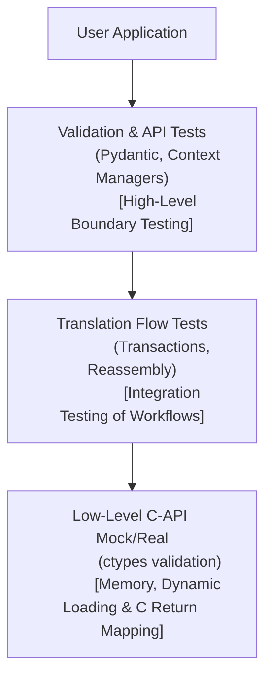

# SDK Test Scenarios Specification

This document defines the high-level test scenarios for verifying the correctness, reliability, and security of the IBM Storage Protect Python SDK.

---

## 1. Test Strategy Overview

The testing strategy is designed to validate both functional behavior and non-functional requirements (such as memory safety, thread isolation, and error mapping resilience) across all architectural layers.

---

## 2. High-Level Test Scenarios (TS)

### 2.1. Session & Lifecycle Management (TS-SES)
- **TS-SES-01 (Connection & Session Handshake)**: Verify that client sessions can be established and terminated cleanly using standard credentials and dynamic configurations.
- **TS-SES-02 (Lifecycle Automation)**: Verify that the context manager protocol automatically closes active C handles and frees resources upon block exit, including in exception paths.
- **TS-SES-03 (System Information & Metadata)**: Validate that connection options, version info, capabilities, and settings are correctly queryable and formatted.
- **TS-SES-04 (Credential Updates)**: Verify that passwords can be updated and that subsequent logins successfully authenticate using new credentials.

### 2.2. Data Backup & Policies (TS-BK)
- **TS-BK-01 (Payload Streaming & Formatting)**: Validate backing up files using byte arrays, open files, and chunk generator functions.
- **TS-BK-02 (Buffer Constraints & Guards)**: Verify client-side guards that enforce the native 4MB chunk limit, raising a Python exception before memory corruption occurs.
- **TS-BK-03 (Policy Matching & Binding)**: Verify that files are correctly bound to designated management class policies and reject invalid configurations.
- **TS-BK-04 (Transactional Commits)**: Verify transactional backup blocks, ensuring that failures trigger rollbacks (`DSM_VOTE_ABORT`) and successful batches trigger commits (`DSM_VOTE_COMMIT`).
- **TS-BK-05 (Logical Groups)**: Validate transactional group backups, verifying leader-member setups and metadata filespace persistence.
- **TS-BK-06 (Group Reopen & Modification)**: Validate reopening an existing closed group backup to add new member objects, loading group details from a local JSON metadata file, removing member objects by key, and deleting groups.

### 2.3. Data Restore & Reassembly (TS-RS)
- **TS-RS-01 (Streaming Reconstruction)**: Validate recovering active and inactive object versions in 1MB chunks via stream generators.
- **TS-RS-02 (Multi-Part Ordering)**: Verify reassembly of multi-part objects split across multiple storage locations, ensuring they are sorted and retrieved in the correct sequence.
- **TS-RS-03 (Sub-range Retrieval)**: Validate partial object restores using explicit offsets and lengths.
- **TS-RS-04 (Batch Restoration)**: Verify restoring multiple objects concurrently in optimized batches.
- **TS-RS-05 (Group Restoration)**: Validate atomic recovery of all group members associated with a group leader.
- **TS-RS-06 (Point-in-Time Restore)**: Validate recovering historical object versions as they existed at a specific past timestamp (e.g., 1, 7, or 30 days ago) or specific date and time.

### 2.4. Namespace Control & Object Management (TS-CT)
- **TS-CT-01 (Idempotent Filespaces)**: Verify filespace registration, capacity and occupancy updates, and deletion. Ensure filespace registration is idempotent.
- **TS-CT-02 (Object Lifecycle Control)**: Validate deleting objects by name and deleting objects by Object ID (hi/lo pairs).
- **TS-CT-03 (Namespace Modifications)**: Verify renaming objects with and without the merge flag enabled.
- **TS-CT-04 (Metadata Attribute Modification)**: Validate updating object owners and management class bindings.

### 2.5. Queries & Search Patterns (TS-QY)
- **TS-QY-01 (Wildcard Queries)**: Validate querying active and inactive object listings using prefix patterns and standard asterisks.
- **TS-QY-02 (System Capability Queries)**: Verify querying policy management classes and active node filespaces.
- **TS-QY-03 (Query Filters & Pagination)**: Validate querying backed-up objects using detailed filters, including object state, object type, filespace patterns, and pagination using maximum key limits.

### 2.6. Robustness & Non-Functional Compliance (TS-NFR)
- **TS-NFR-01 (Dynamic Shared Libraries)**: Validate dynamic library loader paths, checking environment variable overrides and path search priorities.
- **TS-NFR-02 (ctypes Memory Anchoring)**: Verify that dynamic pointers and arrays passed to ctypes calls are anchored to python object references, preventing premature garbage collection.
- **TS-NFR-03 (Error Mapping & Fail-safes)**: Validate that C API return codes are translated into the custom Python exception hierarchy, capturing transient flags, retry delays, and fallback codes.
- **TS-NFR-04 (Credential Sanitization)**: Verify that passwords and access tokens are sanitized from all logs, exception descriptions, and serialized dictionaries.
- **TS-NFR-05 (Thread Isolation)**: Validate that sessions and handles are restricted to their originating thread, raising errors on concurrent cross-thread access.
