# Design Coverage Matrix

This document provides a design-coverage traceability matrix, mapping the requirements of the IBM Storage Protect Python SDK to the high-level architecture (HLD), low-level component specifications (LLD), and the concrete classes and methods in the source code.

---

## 1. Functional Requirements Design Coverage (FR)

| Req ID | Requirement Description | HLD Section | LLD Class/Method | Source Code Implementation | C API Function |
| :--- | :--- | :--- | :--- | :--- | :--- |
| **FR-SES-01** | Session login & authentication | HLD 1.0, 3.1 | `ClientSession.login()` | [session.py](../../src/ibm_storage_protect/session.py) | `dsmInitEx` |
| **FR-SES-02** | Session termination | HLD 1.0, 2.1 | `ClientSession.logout()` | [session.py](../../src/ibm_storage_protect/session.py) | `dsmTerminate` |
| **FR-SES-03** | Auto-logout context manager | HLD 2.1 | `ClientSession.__exit__()` | [session.py](../../src/ibm_storage_protect/session.py) | `dsmTerminate` |
| **FR-SES-04** | Session capabilities retrieval | HLD 1.0 | `ClientSession.get_info()` | [session.py](../../src/ibm_storage_protect/session.py) | `dsmQuerySessInfo`, `dsmQuerySessOptions` |
| **FR-SES-05** | Password rotation updates | HLD 1.0 | `ClientSession.change_password()` | [session.py](../../src/ibm_storage_protect/session.py) | `dsmChangePW` |
| **FR-BK-01** | Single object backup streaming | HLD 1.0, 3.2 | `BackupClient.backup()` | [backup.py](../../src/ibm_storage_protect/data_client/backup.py) | `dsmSendObj`, `dsmSendData` |
| **FR-BK-02** | Policy bind checks | HLD 1.0 | `BackupOperation` | [single.py](../../src/ibm_storage_protect/c_api_bridge/wrappers/backup/single.py) | `dsmBindMC` |
| **FR-BK-03** | Backup transaction boundaries | HLD 2.3 | `BackupOperation.execute()` | [single.py](../../src/ibm_storage_protect/c_api_bridge/wrappers/backup/single.py) | `dsmBeginTxn`, `dsmEndTxnEx` |
| **FR-BK-04** | Batch backup optimization | HLD 2.3, 3.2 | `BatchBackupOperation.execute()` | [batch.py](../../src/ibm_storage_protect/c_api_bridge/wrappers/backup/batch.py) | `dsmBeginTxn`, `dsmEndTxnEx` |
| **FR-BK-05** | Transactional group backup | HLD 1.0, 3.2 | `GroupHandle` manager | [group.py](../../src/ibm_storage_protect/c_api_bridge/wrappers/backup/group.py) | `dsmGroupHandler` |
| **FR-RS-01** | Single object data restore | HLD 1.0, 3.3 | `RestoreClient.restore()` | [restore.py](../../src/ibm_storage_protect/data_client/restore.py) | `dsmBeginGetData`, `dsmGetObj` |
| **FR-RS-02** | Multi-part order reassembly | HLD 1.0, 3.3 | `RestoreOperation` | [single.py](../../src/ibm_storage_protect/c_api_bridge/wrappers/restore/single.py) | Metadata `restoreOrder` sorting |
| **FR-RS-03** | Partial Restore (POR) offsets | HLD 1.0, 3.3 | `RestoreOperation` | [single.py](../../src/ibm_storage_protect/c_api_bridge/wrappers/restore/single.py) | `dsmGetList` (POR) |
| **FR-RS-04** | Streaming generator chunks | HLD 1.0 | `RestoreOperation` generator | [single.py](../../src/ibm_storage_protect/c_api_bridge/wrappers/restore/single.py) | `dsmGetObj`, `dsmGetData` |
| **FR-RS-05** | Batch Restore optimizations | HLD 3.3 | `BatchRestoreOperation` | [batch.py](../../src/ibm_storage_protect/c_api_bridge/wrappers/restore/batch.py) | `dsmBeginGetData` |
| **FR-RS-06** | Group Restore atomicity | HLD 3.3 | `GroupRestoreOperation` | [group.py](../../src/ibm_storage_protect/c_api_bridge/wrappers/restore/group.py) | `dsmBeginGetData` |
| **FR-CT-01** | Filespace Registration | HLD 1.0 | `ControlClient.register_filespace()` | [control.py](../../src/ibm_storage_protect/control.py) | `dsmRegisterFS` |
| **FR-CT-02** | Filespace updates & metrics | HLD 1.0 | `ControlClient.update_filespace()` | [control.py](../../src/ibm_storage_protect/control.py) | `dsmUpdateFS` |
| **FR-CT-03** | Filespace deletion | HLD 1.0 | `ControlClient.delete_filespace()` | [control.py](../../src/ibm_storage_protect/control.py) | `dsmDeleteFS` |
| **FR-CT-04** | Object delete by key name | HLD 1.0 | `ControlClient.delete_by_name()` | [object.py](../../src/ibm_storage_protect/c_api_bridge/wrappers/object.py) | `dsmDeleteObj` (delBack) |
| **FR-CT-05** | Object delete by Object ID | HLD 1.0 | `ControlClient.delete_by_id()` | [object.py](../../src/ibm_storage_protect/c_api_bridge/wrappers/object.py) | `dsmDeleteObj` (delBackID) |
| **FR-CT-06** | Object rename with version merge | HLD 1.0 | `ControlClient.rename()` | [object.py](../../src/ibm_storage_protect/c_api_bridge/wrappers/object.py) | `dsmRenameObj` |
| **FR-CT-07** | Object owner and class updates | HLD 1.0 | `ControlClient.update()` | [object.py](../../src/ibm_storage_protect/c_api_bridge/wrappers/object.py) | `dsmUpdateObjEx` |
| **FR-QY-01** | Listing filespace object keys | HLD 1.0 | `QueryClient.list_objects()` | [query.py](../../src/ibm_storage_protect/query.py) | `dsmBeginQuery` |
| **FR-QY-02** | Granular backup version query | HLD 1.0 | `QueryClient.query_objects()` | [query.py](../../src/ibm_storage_protect/query.py) | `dsmBeginQuery`, `dsmGetNextQObj` |
| **FR-QY-03** | Group membership query | HLD 1.0 | `QueryClient.query_group_members()` | [query.py](../../src/ibm_storage_protect/query.py) | `dsmBeginQuery`, `dsmGetNextQObj` |
| **FR-QY-04** | Query registered filespaces | HLD 1.0 | `QueryClient.query_filespaces()` | [query.py](../../src/ibm_storage_protect/query.py) | `dsmBeginQuery`, `dsmGetNextQObj` |
| **FR-QY-05** | Policy class info query | HLD 1.0 | `QueryClient.query_mgmt_classes()` | [query.py](../../src/ibm_storage_protect/query.py) | `dsmBeginQuery`, `dsmGetNextQObj` |

---

## 2. Non-Functional Requirements Design Coverage (NFR)

| Req ID | Requirement Description | HLD Section | LLD Class/Method | Source Code Implementation | Design Mechanism |
| :--- | :--- | :--- | :--- | :--- | :--- |
| **NFR-PF-01** | Runtime compatibility Python 3.9+ | HLD 1.0 | Standard library calls | [pyproject.toml](../../pyproject.toml) | Package requirement configurations |
| **NFR-PF-02** | Native shared library loading | HLD 1.0 | C dynamic loader logic | [load.py](../../src/ibm_storage_protect/c_api_bridge/c_api/load.py) | Platform-specific suffix resolver (`CDLL`) |
| **NFR-PF-03** | Loading path lookup priorities | HLD 1.0 | C library load sequence | [load.py](../../src/ibm_storage_protect/c_api_bridge/c_api/load.py) | Checks `IBM_SP_API_LIB` -> system -> local |
| **NFR-PF-04** | Global cleanup on process exit | HLD 2.1 | `atexit` clean-up hook | [load.py](../../src/ibm_storage_protect/c_api_bridge/c_api/load.py) | Registers `atexit.register(lib.dsmCleanUp)` |
| **NFR-PERF-01**| Max chunk size 4MB limit | HLD 1.0 | `validate_chunks()` | [helper.py](../../src/ibm_storage_protect/c_api_bridge/wrappers/helper.py) | Raises client-side `TSMDataError` if chunk > 4MB |
| **NFR-PERF-02**| Streams restore in 1MB buffers | HLD 1.0 | `RestoreOperation` buffer | [single.py](../../src/ibm_storage_protect/c_api_bridge/wrappers/restore/single.py) | Pre-allocates ctypes buffer of 1MB (1048576) |
| **NFR-PERF-03**| Input Pydantic validations | HLD 1.0, 2.2 | Data model schema check | [data_models/](../../src/ibm_storage_protect/data_models/) | Automatic checks on data model instantiations |
| **NFR-PERF-04**| Reference memory anchoring | HLD 1.0 | `_build_get_list()` | [single.py](../../src/ibm_storage_protect/c_api_bridge/wrappers/restore/single.py) | Returns tuple containing pointer arrays to prevent GC |
| **NFR-ERR-01** | Exception translation mapping | HLD 2.4 | `mapper` registry map | [mapper.py](../../src/ibm_storage_protect/errors/mapper.py) | Translates raw integer C RCs to `TSMError` subclasses |
| **NFR-ERR-02** | Transient delay suggestions | HLD 2.4 | `mapper` suggestions | [mapper.py](../../src/ibm_storage_protect/errors/mapper.py) | Attaches retry boolean and delay seconds metadata |
| **NFR-ERR-03** | Abort txn (`DSM_VOTE_ABORT`) | HLD 2.3 | `try...except` rollbacks | [single.py](../../src/ibm_storage_protect/c_api_bridge/wrappers/backup/single.py) | Aborts active transactions on any raised exceptions |
| **NFR-ERR-04** | Unmapped return code fallback | HLD 2.4 | `check_rc()` fallback | [helper.py](../../src/ibm_storage_protect/c_api_bridge/wrappers/helper.py) | Raises `TSMSystemError` (TSM-9105) for unmapped codes |
| **NFR-SEC-01** | Log and exception credential masking | HLD 2.5 | Pydantic field masking | [session.py](../../src/ibm_storage_protect/data_models/session.py) | Sanitizes `password` field from representation and dumps |
| **NFR-LOG-01** | Structured log metrics | HLD 2.5 | `set_log_context()` | [context.py](../../src/ibm_storage_protect/logger/context.py) | Enriches logs with duration, session/operation IDs |
| **NFR-THR-01** | Thread boundary validation | HLD 2.2 | Thread check guards | [session.py](../../src/ibm_storage_protect/session.py) | Restricts connection interactions to originating threads |

---

## 3. Design Coverage Summary

```mermaid
graph TD
    subgraph L1["High-Level Client Layer"]
        SES["FR-SES Session Management\nClientSession — login, logout, get_info, change_password"]
        BKC["FR-BK Backup\nBackupClient / DataClient — backup, batch_backup"]
        RSC["FR-RS Restore\nRestoreClient / DataClient — restore, batch_restore, group_restore"]
        CTC["FR-CT Control\nControlClient — filespace & object operations"]
        QYC["FR-QY Query\nQueryClient — list, query_objects, query_filespaces"]
    end

    subgraph L2["Validation & Serialization Layer"]
        PERF3["NFR-PERF-03 Pydantic guard rails\ndata_models/ — validates all inputs before C calls"]
        SEC1["NFR-SEC-01 Credential masking\ndata_models/session.py — password field redaction"]
    end

    subgraph L3["C-API Translation Layer (wrappers)"]
        BK3["FR-BK-03 Transaction safety\nbackup/single.py — dsmBeginTxn/dsmEndTxnEx + abort on error"]
        RS2["FR-RS-02 Part reassembly\nrestore/single.py — restoreOrder sort + sequential retrieval"]
        ERR3["NFR-ERR-03 Abort on failure\nAll wrappers — DSM_VOTE_ABORT in except blocks"]
        PERF4["NFR-PERF-04 Memory anchoring\nrestore/single.py — _build_get_list returns anchored tuple"]
        PERF1["NFR-PERF-01 4MB chunk limit\nhelper.py — validate_chunks() guard"]
        ERR4["NFR-ERR-04 Unmapped RC fallback\nhelper.py — check_rc() TSMSystemError fallback"]
    end

    subgraph L4["ctypes Binding Layer (c_api)"]
        PF2["NFR-PF-02 Cross-platform library load\nload.py — CDLL with platform-specific paths"]
        PF3["NFR-PF-03 Load path priority\nload.py — IBM_SP_API_LIB > platform > working dir"]
        PF4["NFR-PF-04 Global cleanup\nload.py — atexit.register(lib.dsmCleanUp)"]
        ERR1["NFR-ERR-01 Exception mapping\nerrors/mapper.py — RC → TSMError subclass registry"]
        ERR2["NFR-ERR-02 Retry metadata\nerrors/mapper.py — retry_recommended, retry_after"]
        LOG1["NFR-LOG-01 Structured logging\nlogger/context.py — session_id, operation_id, duration_ms"]
    end

    L1 --> L2 --> L3 --> L4
```

- **Total Requirements Specification**: 41
- **Requirements Covered by System Architecture & Code Design**: 41
- **Design Coverage Rate**: **100%**
