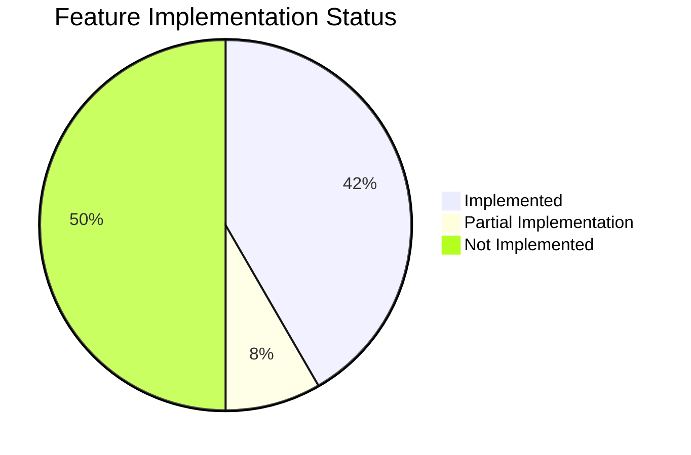
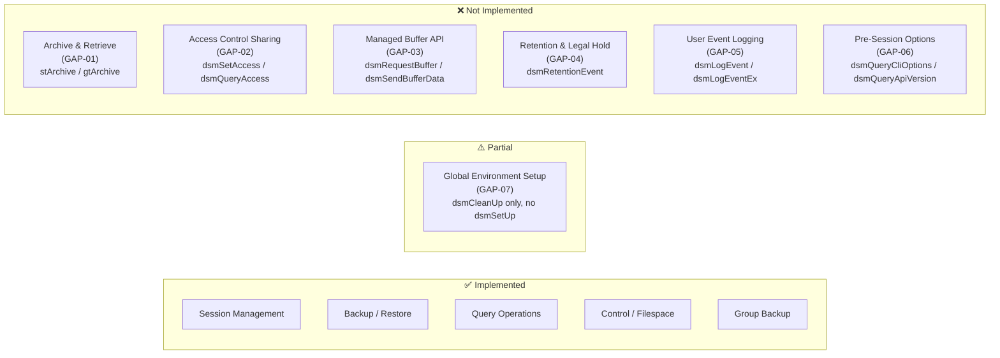

# Feature Gap Analysis: IBM Storage Protect Python SDK vs. Native C API

This document analyzes the functional gaps between the complete features supported by the native IBM Storage Protect C API (as documented in `b_api_using.pdf` and defined in the C prototypes) and the features implemented in the Python SDK.

---

## 1. Gap Status Overview

---

## 1. Feature Gap Matrix

| Gap ID | Feature Category | Native C API Functionality | Python SDK Status | Impact / Missing Functionality |
| :--- | :--- | :--- | :--- | :--- |
| **GAP-01** | **Archive and Retrieve** | Supports long-term static storage (archives) using `stArchive` send types and `gtArchive` get types. Utilizes distinct server policy structures for static retention times. | **Not Implemented** | Exposes zero interfaces for archiving data or retrieving archived copies. Only backup/restore operations (`stBackup`, `gtBackup`) are supported. |
| **GAP-02** | **Access Control Sharing** | Supports sharing object access with other nodes/owners on the TSM server via `dsmSetAccess`, `dsmQueryAccess`, and `dsmDeleteAccess`. | **Not Implemented** | C ctypes signatures are declared in [prototypes.py](../../src/ibm_storage_protect/c_api_bridge/c_api/prototypes.py), but no high-level controls exist. Python applications cannot grant, inspect, or revoke cross-node sharing rules. |
| **GAP-03** | **Managed Buffer API** | High-performance zero-copy operations using direct memory allocation buffers managed by the library (`dsmRequestBuffer`, `dsmReleaseBuffer`, `dsmSendBufferData`, `dsmGetBufferData`). | **Not Implemented** | The SDK only implements standard streaming data transfer (`dsmSendData`, `dsmGetData`), which incurs memory copying overhead from Python bytes into C arrays. Exposes no buffer management interfaces. |
| **GAP-04** | **Retention Event & Legal Hold** | Supports compliance storage policies, legal holds, and WORM retention events using `dsmRetentionEvent`. | **Not Implemented** | Python wrapper has no interface to trigger retention holds or modify compliance locks on stored objects. |
| **GAP-05** | **User Event Logging** | Allows application logs to be written directly to the server's activity log or local error log via `dsmLogEvent` and `dsmLogEventEx`. | **Not Implemented** | C signatures are declared, but the SDK has no high-level logging function that can stream custom application events directly to the server's logs. |
| **GAP-06** | **Pre-Session Options & Version Queries** | Queries local client option files (`dsm.opt` / `dsm.sys`) via `dsmQueryCliOptions` and library version data via `dsmQueryApiVersion` / `dsmQueryApiVersionEx` before a connection is established. | **Not Implemented** | Callers cannot query the library version or local configuration settings programmatically without first establishing an active, authenticated network session. |
| **GAP-07** | **Global Environment Setup** | Allows global, post-load environment overrides (e.g. customized delimiters or trace files) using `dsmSetUp` and `dsmCleanUp`. | **Partial Implementation** | Only basic process-level registration of `dsmCleanUp` is executed at shutdown via `atexit` (in [session.py](../../src/ibm_storage_protect/c_api_bridge/wrappers/session.py)). No interface is exposed for callers to configure global parameters using `dsmSetUp`. |

---

## 2. Gap Explanations & Architectural Recommendations

### 2.1. Archive/Retrieve Operations (GAP-01)
- **Technical Context**: TSM treats Backups and Archives differently. Backups maintain version histories (active and inactive versions) where older versions are automatically rotated. Archives are point-in-time snapshots with a fixed, absolute retention period (e.g., 7 years) and are retrieved by absolute descriptor keys.
- **Recommendation**: Extend [DataClient](../../src/ibm_storage_protect/data_client/client.py) to instantiate `ArchiveClient` and `RetrieveClient` classes. Refactor `BackupOperation` to accept `SendType` (stBackup/stArchive) and `RestoreOperation` to accept `GetType` (gtBackup/gtArchive).

### 2.2. Managed Buffer API (GAP-03)
- **Technical Context**: The standard data path (`dsmSendData`) copies data from Python buffers into ctypes arrays and down to TSM buffers. For high-speed backup operations (e.g. streaming databases), this double-copying degrades performance.
- **Recommendation**: Create a specialized data path within `BackupClient` that invokes `dsmRequestBuffer` to grab an allocated C buffer from the TSM library, copies Python memory directly to the raw pointer via `ctypes.memmove`, and sends it via `dsmSendBufferData`.

### 2.3. Sharing & Access Rights (GAP-02)
- **Technical Context**: In multi-user and multi-tenant environments, nodes frequently need to access filespaces belonging to peer applications.
- **Recommendation**: Implement `BAAccessClient` in [control.py](../../src/ibm_storage_protect/control.py) exposing `set_access_rules()`, `list_access_rules()`, and `revoke_access_rules()` wrapping `dsmSetAccess`, `dsmQueryAccess`, and `dsmDeleteAccess`.

---

## 3. Future Planned Supported Platforms

The following platforms are planned for future support:

- **Windows**
- **AIX**
- **macOS**

Currently, the SDK officially supports Linux only. Support for additional platforms will be added in future releases as development resources permit.
