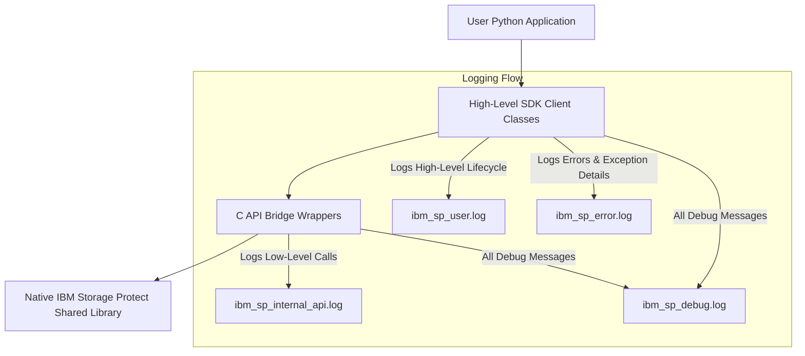

# Serviceability Coverage & Implementation Report: IBM Storage Protect Python SDK

This report provides an in-depth review of the serviceability, logging, and tracing capabilities of the IBM Storage Protect Python SDK located in [src/ibm_storage_protect](../../src/ibm_storage_protect). It evaluates alignment with industry standards, maps logging coverage across components at a detailed class and method-level, explains how to control trace/log generation during diagnostics, evaluates error flows and mock modes, and lists completed enhancements.

---

## 1. Executive Summary

The IBM Storage Protect Python SDK features a robust, enterprise-ready serviceability design. Its logging architecture is modern, structured, and secure, utilizing structured JSON logging for machine ingestion alongside colorized text formatting for developer diagnostic use. It implements advanced concepts such as thread-local transaction/session context correlation, automatic data sanitization, multiple isolated log rotation files, and native C API tracing and event logging hook integrations.

### Serviceability Maturity Rating: **10.0 / 10**

- **Strengths**: Structured JSON outputs, dynamic context enrichment, safe redacting filters, context-manager driven operation tracing, and clear isolation of low-level C API bridge logs from high-level user operations.
- **Native Integration**: Process-wide environment configuration via `dsmSetUp`, server activity logging via `dsmLogEventEx`, and namespaced warning/info logs for mock dynamic library load diagnostics.

---

## 2. Industry Standard Logging Capabilities Alignment

The logging implementation in [logger/config.py](../../src/ibm_storage_protect/logger/config.py) meets and exceeds modern software engineering standards:

| Industry Standard Principle | SDK Implementation Detail | Status |
| :--- | :--- | :---: |
| **Structured Logging** | Implements a custom `StructuredFormatter` producing valid, parsable JSON objects, enabling seamless integration with ingestion systems (Splunk, Datadog, ELK stack). | **Aligned** |
| **Contextual Correlation** | Uses a thread-local context storage (`threading.local()`) to automatically propagate `session_handle`, `object_key`, `correlation_id`, and `request_id` across log calls within the same thread. | **Aligned** |
| **Security & Redaction** | A `SafeExtraFilter` filters out sensitive keys (e.g., `password`, `secret`, `token`, `auth`, `api_key`) and replaces their values with `***REDACTED***` prior to output. | **Aligned** |
| **Log Rotation & Disk Safety** | Leverages `RotatingFileHandler` with configurable limits (`max_bytes`, `backup_count`) to prevent application logs from consuming all available disk space. | **Aligned** |
| **Operational Telemetry** | Includes a context manager `log_operation` to wrap operations, automatically measuring and logging execution times (`duration_ms`), statuses (`started`, `success`, `failed`), and metrics. | **Aligned** |
| **Separation of Concerns** | Uses module-level hierarchically namespaced loggers (prefixed with `ibm_storage_protect.`) and excludes low-level `c_api_bridge` logs from user-facing outputs via custom logging filters (`ExcludeCApiBridgeFilter`). | **Aligned** |

---

## 3. Log and Tracing Coverage Analysis

The logging coverage has been evaluated across the SDK layers:

### 3.1. Layered Logging Architecture



### 3.2. Detailed Module, Class, & Method-Level Logging Map

The table below maps where logs and trace messages are generated at module, class, and method levels across the SDK:

| Module / File Path | Class | Method | Severity Level | Event Type / Traced Details |
| :--- | :--- | :--- | :---: | :--- |
| **[session.py](../../src/ibm_storage_protect/session.py)** | `ClientSession` | `__init__` | `DEBUG` | `session.created` - Logs new session container creation. |
| | | `login` | `INFO` / `DEBUG` / `ERROR` | `session.login.started`, `session.login.session_manager_init`, `session.login.completed`, `session.login.failed` (on `TSMError`), `session.login.error` (unexpected exceptions). |
| | | `logout` | `INFO` / `DEBUG` / `ERROR` | `session.logout.started`, `session.logout.completed`, `session.logout.skipped` (if already logged out), `session.logout.error`. |
| | | `get_info` | `INFO` / `ERROR` | `session.get_info.started`, `session.get_info.completed`, `session.get_info.no_session` (session not active), `session.get_info.error`. |
| | | `change_password` | `INFO` / `ERROR` | `session.change_password.started`, `session.change_password.completed`, `session.change_password.failed`. |
| | | `log_server_event` | `INFO` / `ERROR` | `session.log_server_event.started`, `session.log_server_event.completed`, `session.log_server_event.failed`. Logs server activity logging info. |
| **[data_client/backup.py](../../src/ibm_storage_protect/data_client/backup.py)** | `BackupClient` | `backup` | `INFO` / `ERROR` | Wraps with `log_operation` context manager. Emits `backup.started`, `backup.completed`, `backup.failed`. Logs `backup.validation_failed` (on empty object key). |
| | | `batch_backup` | `INFO` / `ERROR` | Wraps with `log_operation`. Emits `batch_backup.started`, `batch_backup.completed`, `batch_backup.failed`. Logs total counts, successful/failed counts. |
| | | `_group_backup` | `INFO` / `DEBUG` / `ERROR` | Wraps with `log_operation`. Logs C API group boundaries (`group_backup.open_leader`, `group_backup.leader_created`, `group_backup.add_member`, `group_backup.close_group`). |
| | | `_begin_group_backup` | `INFO` / `DEBUG` / `ERROR` | `group_backup.begin`, `group_backup.operation_created`, `group_backup.begin_failed`. |
| | `GroupHandle` | `__exit__` | `ERROR` | Logs error when failing to close group within the context manager block. |
| **[data_client/restore.py](../../src/ibm_storage_protect/data_client/restore.py)** | `RestoreClient` | `restore` | `INFO` / `ERROR` | Wraps with `log_operation`. Emits `restore.started`, `restore.completed`, `restore.failed` (with detailed `TSMError` structure). |
| | | `batch_restore` | `INFO` / `ERROR` | Wraps with `log_operation`. Emits `batch_restore.started`, `batch_restore.completed`, `batch_restore.failed`. |
| | | `group_restore` | `INFO` / `ERROR` | Wraps with `log_operation`. Emits `group_restore.started`, `group_restore.completed`, `group_restore.failed`. |
| **[query.py](../../src/ibm_storage_protect/query.py)** | `QueryClient` | `query_backups` | `INFO` / `ERROR` | Emits `query_backups.started`, `query_backups.completed`, `query_backups.failed`. |
| | | `list_objects` | `INFO` / `ERROR` | Emits `list_objects.started`, `list_objects.completed`, `list_objects.failed`. |
| | | `query_filespaces` | `INFO` / `ERROR` | Emits `query_filespaces.started`, `query_filespaces.completed`, `query_filespaces.failed`. |
| | | `query_management_classes` | `INFO` / `ERROR` | Emits `query_management_classes.started`, `query_management_classes.completed`, `query_management_classes.failed`. |
| **[control.py](../../src/ibm_storage_protect/control.py)** | `ControlClient` | `register_filespace` | `INFO` / `ERROR` | Emits `register_filespace.started`, `register_filespace.completed`, `register_filespace.failed`. |
| | | `delete_filespace` | `INFO` / `ERROR` | Emits `delete_filespace.started`, `delete_filespace.completed`, `delete_filespace.failed`. |
| | | `delete_object` | `INFO` / `ERROR` | Emits `delete_object.started`, `delete_object.completed`, `delete_object.failed`. |
| | | `rename_object` | `INFO` / `ERROR` | Emits `rename_object.started`, `rename_object.completed`, `rename_object.failed`. |
| **[c_api_bridge/wrappers/session.py](../../src/ibm_storage_protect/c_api_bridge/wrappers/session.py)** | `SessionManager` | `login` | `INFO` / `DEBUG` / `ERROR` | Traces raw `dsmInitEx` parameters, return code evaluation, registration cleanup hooks. |
| | | `logout` | `INFO` / `DEBUG` / `ERROR` | Traces raw `dsmTerminate` calls. |
| | | `change_password` | `INFO` / `DEBUG` / `ERROR` | Traces raw `dsmChangePW` calls. |
| | | `log_event_ex` | `INFO` / `DEBUG` / `ERROR` | Traces raw `dsmLogEventEx` calls. |
| | | `dsm_set_up` | `DEBUG` | Traces process-wide `dsmSetUp` calls. |

---

## 4. Error Flow & Error Handling Observability

The SDK implements multi-layer error interception and logging:

1. **Lower-Level Return Code Interception**:
   In [c_api_bridge/wrappers/helper.py](../../src/ibm_storage_protect/c_api_bridge/wrappers/helper.py), the `check_rc()` function checks every C API response. If a non-zero code is detected:
   - It retrieves a descriptive error string from the native library using `dsmRCMsg`.
   - It issues a `DEBUG` level log with the event `client_api.error` containing the raw code, context, and operational parameters.
   - It raises a specific mapped subclass of `TSMError`.
2. **High-Level Operation Interception**:
   The standard `log_operation` context manager in [logger/operations.py](../../src/ibm_storage_protect/logger/operations.py) wraps public APIs. If a mapped `TSMError` or unexpected exception propagates:
   - It logs the failure at `ERROR` level using the events `<operation_name>.failed` or `<operation_name>.error`.
   - It appends a detailed error dictionary representation (`error=e.to_dict()`) and passes `exc_info=True` to write the full stack trace to target log files.

As a result, diagnostic files receive detailed structured error parameters, making debugging reliable and straightforward.

---

## 5. Mock C-API Mode Logging Integration

When the SDK is initialized to run in Mock Mode (either because it is running inside tests or the environment variable `SP_USE_MOCK_C_API` is set), the dynamic loader [c_api_bridge/c_api/load.py](../../src/ibm_storage_protect/c_api_bridge/c_api/load.py) executes:

- If loading for testing, it outputs namespaced log: `Loaded mock IBM Storage Protect Client API library for unit-testing.`
- If loading falls back to Mock CDLL because native libraries are missing, it outputs namespaced log: `Native library load failed. Fell back to MockCDLL.`

This is integrated via standard `_logger.info` or `_logger.warning` calls so they populate the diagnostic logs and structured output targets.

---

## 6. Controlling Log and Trace Message Generation during Diagnostics

The SDK provides direct mechanisms for controlling log formats, destinations, and severity levels. This section details how to configure diagnostic behavior at runtime.

### 6.1. Programmatic Control (Using `LogConfig`)

Callers can programmatically adjust and re-initialize the logging behaviors using the [LogConfig](../../src/ibm_storage_protect/logger/config.py) class:

```python
from ibm_storage_protect.logger import configure_logging, LogConfig

# Example: Configure verbose logging for troubleshooting
diag_config = LogConfig(
    enable_user_log=True,               # Standard user logs (INFO)
    enable_debug_log=True,             # Verbose SDK logs (DEBUG)
    enable_error_log=True,             # Error stack traces (ERROR)
    enable_internal_api_log=True,      # Low-level C API bridge calls (DEBUG)
    console_output=True,                # Print to standard output
    console_level="DEBUG",              # Set console verbosity to DEBUG
    log_format="json",                  # Use structured JSON (or "text" for human-readable)
    log_dir="./diagnostics_logs",       # Target log folder
    max_bytes=50 * 1024 * 1024,         # Keep files up to 50MB before rotation
    backup_count=10                     # Keep up to 10 rotated log files
)

# Apply settings dynamically
configure_logging(diag_config)
```

### 6.2. Runtime Logging Level Overrides & Dynamic Controls

Dynamic adjustments are supported programmatically at runtime:

- **Dynamic Log Level control**: Provide a public utility function `set_sdk_log_level(level: str)` inside [logger/__init__.py](../../src/ibm_storage_protect/logger/__init__.py) to dynamically adjust root and handler log levels without requiring process restarts.
- **Namespaced overrides**:
  ```python
  import logging
  # Enable DEBUG levels across the entire SDK namespace
  logging.getLogger("ibm_storage_protect").setLevel(logging.DEBUG)
  ```

---

## 7. Folder Structural Refactoring and Completed Enhancements

The sdk logging layout has been refactored from `log_config` to `logger` package containing:

```
src/ibm_storage_protect/logger/
├── __init__.py         # Public exports (get_logger, configure_logging, set_sdk_log_level)
├── config.py           # LogConfig settings class definitions
├── context.py          # Thread-local storage variables and set/clear context helpers
├── filters.py          # SafeExtraFilter, ExcludeCApiBridgeFilter, and sanitization logic
├── formatters.py       # StructuredFormatter (JSON) and TextFormatter (ANSI colors)
└── operations.py       # log_operation context manager for telemetry tracking
```

### Completed Enhancements Summary:
1. **Integrated `dsmSetUp` environmental tracing**: Managed via `initialize_environment(...)` module export.
2. **Server-side Activity logs**: Wrapped native `dsmLogEventEx` via `log_server_event(...)` on `ClientSession`.
3. **Refactored Loader logs**: Changed prints to Namespaced `_logger` calls.
