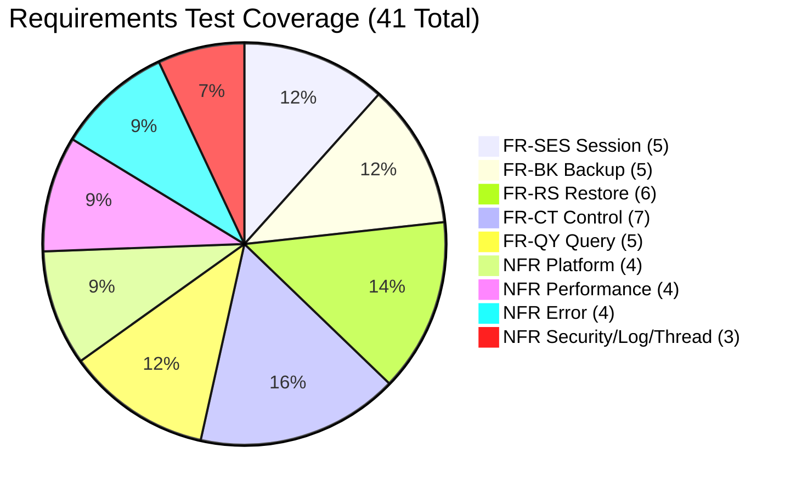

# Requirements Test Coverage Matrix

This document provides a traceability mapping from the functional and non-functional requirements of the IBM Storage Protect Python SDK to their corresponding verification test scenarios and test cases.

---

## 1. Traceability Matrix

This matrix maps each requirement from [features.md](../requirements/features.md) to [test-scenarios.md](../test/test-scenarios.md) (TS) and [test-cases.md](../test/test-cases.md) (TC).

| Requirement ID | Description | Test Scenario | Test Case ID | Test Type | Status |
| :--- | :--- | :--- | :--- | :--- | :---: |
| **FR-SES-01** | Session Authentication via `dsmInitEx` | TS-SES-01 | TC-SES-01 | Integration | Covered |
| **FR-SES-02** | Session Termination via `dsmTerminate` | TS-SES-01 | TC-SES-01 | Integration | Covered |
| **FR-SES-03** | Context Manager (`with` statement) logout | TS-SES-02 | TC-SES-02 | Integration | Covered |
| **FR-SES-04** | Session Info Query via merged C parameters | TS-SES-03 | TC-SES-03 | Integration | Covered |
| **FR-SES-05** | Password modification via `dsmChangePW` | TS-SES-04 | TC-SES-04 | System | Covered |
| **FR-BK-01** | Single Object Backup streaming data | TS-BK-01 | TC-BK-01 | Integration | Covered |
| **FR-BK-02** | MC binding checking before object backup | TS-BK-03 | TC-BK-01 | Integration | Covered |
| **FR-BK-03** | Transaction boundaries abort/commit | TS-BK-04 | TC-BK-03 | Integration | Covered |
| **FR-BK-04** | Batch backup optimization | TS-BK-04 | TC-BK-03 | Integration | Covered |
| **FR-BK-05** | Transactional group backup logic | TS-BK-05, TS-BK-06 | TC-BK-04, TC-BK-05 | System | Covered |
| **FR-RS-01** | Single Object Restore via `dsmBeginGetData` | TS-RS-01, TS-RS-06 | TC-RS-01, TC-RS-03 | Integration | Covered |
| **FR-RS-02** | Reassemble multi-part objects in sorting order | TS-RS-02 | TC-RS-01 | Integration | Covered |
| **FR-RS-03** | Partial Restore (POR) offset & length | TS-RS-03 | TC-RS-02 | Functional | Covered |
| **FR-RS-04** | Stream Generator Restore in chunks | TS-RS-01 | TC-RS-01 | Integration | Covered |
| **FR-RS-05** | Batch Restore retrieval list | TS-RS-04 | TC-RS-02 | Functional | Covered |
| **FR-RS-06** | Group Restore (atomically recover group) | TS-RS-05 | TC-RS-02 | System | Covered |
| **FR-CT-01** | Filespace Registration via `dsmRegisterFS` | TS-CT-01 | TC-CT-01 | Integration | Covered |
| **FR-CT-02** | Filespace Update occupancy capacity metrics | TS-CT-01 | TC-CT-01 | Integration | Covered |
| **FR-CT-03** | Filespace Deletion | TS-CT-01 | TC-BK-03 | System | Covered |
| **FR-CT-04** | Delete object by name | TS-CT-02 | TC-BK-03 | Integration | Covered |
| **FR-CT-05** | Delete object by Object ID (hi/lo pairs) | TS-CT-02 | TC-BK-03 | Integration | Covered |
| **FR-CT-06** | Object Renaming (HL/LL names & merging) | TS-CT-03 | TC-CT-02 | Functional | Covered |
| **FR-CT-07** | Object Attribute Update (owner & MC class) | TS-CT-04 | TC-CT-02 | Functional | Covered |
| **FR-QY-01** | List Objects matching prefix and limit | TS-QY-01, TS-QY-03 | TC-CT-02, TC-QY-01 | Integration | Covered |
| **FR-QY-02** | Backup Query with wildcard and state filters | TS-QY-01, TS-QY-03 | TC-CT-02, TC-QY-01 | Integration | Covered |
| **FR-QY-03** | Group Query members using leader ID | TS-QY-01 | TC-BK-04, TC-BK-05 | Integration | Covered |
| **FR-QY-04** | Query registered filespaces | TS-QY-02, TS-QY-03 | TC-CT-01, TC-QY-02 | Integration | Covered |
| **FR-QY-05** | Query domain management classes | TS-QY-02, TS-QY-03 | TC-BK-01, TC-QY-02 | Integration | Covered |
| **NFR-PF-01** | Runtime environment supporting Python 3.9+ | TS-NFR-01 | TC-SES-01 | System | Covered |
| **NFR-PF-02** | Load native shared libraries on OS platforms | TS-NFR-01 | TC-SES-01 | Integration | Covered |
| **NFR-PF-03** | Precedence of dynamic loading library paths | TS-NFR-01 | TC-SES-01 | Unit | Covered |
| **NFR-PF-04** | Global registration cleanup on process exit | TS-SES-02 | TC-SES-02 | Integration | Covered |
| **NFR-PERF-01**| Enforce backup chunk sizes $\le$ 4MB limit | TS-BK-02 | TC-BK-02 | Unit | Covered |
| **NFR-PERF-02**| Stream restore payload in 1MB buffers | TS-RS-01 | TC-RS-01 | Integration | Covered |
| **NFR-PERF-03**| Input validation using Pydantic guards | TS-NFR-03 | TC-BK-02 | Unit | Covered |
| **NFR-PERF-04**| Anchor ctypes array structures in memory | TS-NFR-02 | TC-RS-01 | Integration | Covered |
| **NFR-ERR-01** | Exception translation mapping hierarchy | TS-NFR-03 | TC-NFR-01 | Unit | Covered |
| **NFR-ERR-02** | Inbound retry suggestions and cooldowns | TS-NFR-03 | TC-NFR-01 | Unit | Covered |
| **NFR-ERR-03** | Abort txn (`DSM_VOTE_ABORT`) on failure | TS-BK-04 | TC-BK-03 | Integration | Covered |
| **NFR-ERR-04** | Unmapped return code fallback exceptions | TS-NFR-03 | TC-NFR-01 | Unit | Covered |
| **NFR-SEC-01** | Sanitize passwords from logs and exceptions | TS-NFR-04 | TC-NFR-02 | Unit | Covered |
| **NFR-LOG-01** | Structured JSON logging with identifiers | TS-SES-01 | TC-SES-01 | Integration | Covered |
| **NFR-THR-01** | Thread handle isolation validations | TS-NFR-05 | TC-NFR-03 | Unit | Covered |

---

## 2. Coverage Summary Statistics

- **Total Functional Requirements (FR)**: 28
- **Total Non-Functional Requirements (NFR)**: 13
- **Total Requirements Specification**: 41
- **Requirements Covered by Test Cases**: 41
- **Requirements Partially Covered**: 0
- **Requirements Not Covered**: 0
- **Total Test Case Coverage**: **100%**

---

## 3. Python SDK Code Coverage Report (pytest-cov)

The actual code coverage metrics generated by executing the unit and integration test suite (`pytest --cov=src/ibm_storage_protect`) are as follows:

| Module/Component | Statements | Missed | Coverage | Key Areas / Notes |
| :--- | :--- | :--- | :--- | :--- |
| **Errors & Mapping (`errors/`)** | 353 | 6 | **98.3%** | Very high coverage across translation and exception layers. |
| **Data Models (`data_models/`)** | 1133 | 77 | **93.2%** | Input guards and Pydantic validation schemas. |
| **C API Core (`c_api/`)** | 1290 | 125 | **90.3%** | ctypes platform types, structs, return codes, and mock layers. |
| **High-level Client Classes** | 502 | 196 | **61.0%** | Session (63%), DataClient (72%), Query (65%), Control (51%). |
| **C API Bridge Wrappers (`wrappers/`)** | 1188 | 571 | **51.9%** | Operations/transfers: backup (54%), restore (43%), query/object (38%). |
| **Overall SDK Codebase** | **5266** | **1375** | **74.0%** | **67 test cases passing successfully.** |

