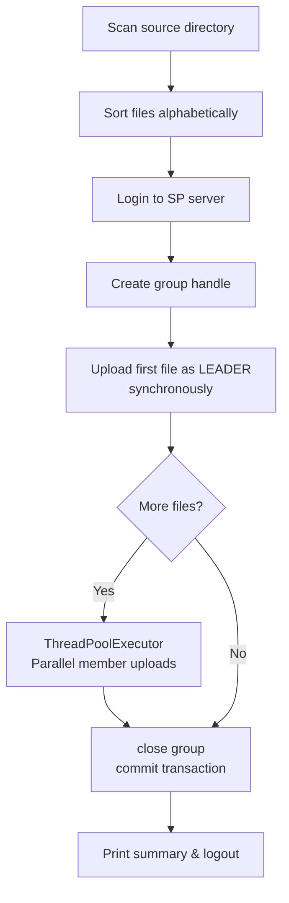
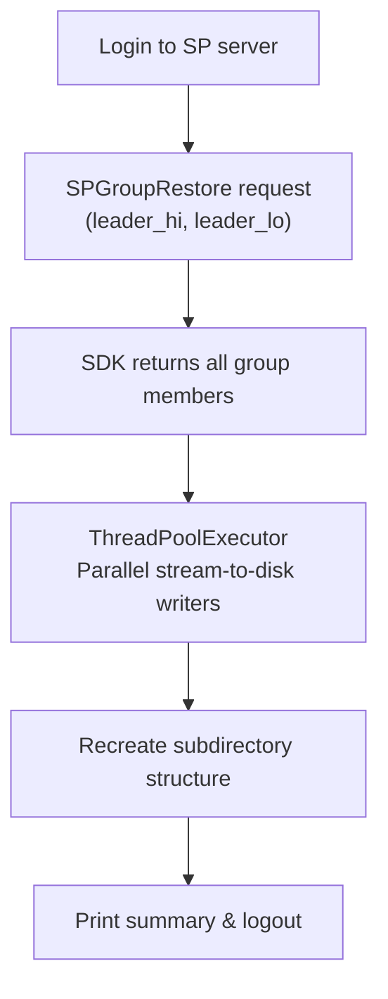

# IBM Storage Protect SDK: Filesystem Backup Examples

This example demonstrates how to back up files and directories to IBM Storage
Protect using various backup strategies including single file backup, batch backup,
and group backup with the SDK's comprehensive API.

---

## 1. Directory Structure

```
examples/filesystem/
├── README.md                    # This guide
├── src/
│   └── protect_filesystem/
│       ├── __init__.py
│       ├── fs_backup.py         # Parallel group backup of a source directory
│       └── fs_restore.py        # Parallel group restore to a destination directory
└── tests/
    ├── conftest.py              # ctypes.CDLL mock and pytest fixtures
    └── test_filesystem_integration.py  # Unit / integration test suite
```

---

## 2. Feature Highlights

| Feature | Detail |
|---------|--------|
| **Group backup** | All files are committed as a single atomic group; the first file becomes the *leader* and the rest are *members* |
| **Parallel upload** | Member files are uploaded concurrently via `ThreadPoolExecutor` (configurable worker count) |
| **Parallel download** | Group restore streams each member to disk concurrently |
| **Directory tree preservation** | Restore reconstructs the original relative path structure under the destination directory |
| **Chunked streaming** | Files are read/written in 4 MiB blocks — memory usage is constant regardless of file size |
| **Environment configuration** | All settings (credentials, filespace, parallelism) are controlled through environment variables |

---

## 3. Configuration & Getting Started

### 3.1. Authentication Credentials

Set the IBM Storage Protect node credentials before running either script.

**Windows PowerShell:**
```powershell
$env:SP_NODE     = "YOUR_NODE"
$env:SP_PASSWORD = "YOUR_PASSWORD"
```

**Linux / macOS:**
```bash
export SP_NODE="YOUR_NODE"
export SP_PASSWORD="YOUR_PASSWORD"
```

### 3.2. Optional Environment Variables

| Variable | Default | Description |
|----------|---------|-------------|
| `SP_FILESPACE` | `/` | Target filespace on the SP server |
| `SP_GROUP_NAME` | `fs-backup-<timestamp>` | Logical group tag (backup only) |
| `SP_MAX_WORKERS` | `4` | Number of parallel upload / download threads |

### 3.3. PYTHONPATH Setup

Add the SDK `src` and the example `src` to your Python path.

**Windows PowerShell (from repository root):**
```powershell
$env:PYTHONPATH = "src;examples/filesystem/src"
```

**Linux / macOS (from repository root):**
```bash
export PYTHONPATH="src:examples/filesystem/src"
```

### 3.4. Dynamic C Library

Ensure the IBM Storage Protect dynamic library is discoverable by the OS loader.  
See the [Getting Started Guide](../../docs/guides/01_introduction.md) for platform-specific instructions.

---

## 4. Usage

### 4.1. Backup a Directory

```bash
python src/protect_filesystem/fs_backup.py <source_directory> [group_name]
```

**Example:**
```bash
python src/protect_filesystem/fs_backup.py /var/app/data my-app-backup
```

Sample output:
```
======================================================================
IBM STORAGE PROTECT — FILESYSTEM GROUP BACKUP
======================================================================
  Source directory : /var/app/data
  Group name       : my-app-backup
  Filespace        : /
  Files discovered : 5
  Parallel workers : 4
======================================================================
✓ Login successful
✓ Group 'my-app-backup' created

  [LEADER] config.json  (2,048 bytes)
  ✓ Leader uploaded

  Uploading 4 member(s) with 4 worker(s)…

  ✓ [MEMBER] data/records.csv  (512,000 bytes)
  ✓ [MEMBER] data/archive.zip  (10,485,760 bytes)
  ✓ [MEMBER] logs/app.log  (98,304 bytes)
  ✓ [MEMBER] reports/summary.pdf  (307,200 bytes)

======================================================================
BACKUP SUMMARY
======================================================================
  Group name   : my-app-backup
  Leader ID    : 0-9011210
  Total files  : 5
  Successful   : 5
  Failed       : 0
  Duration     : 3.42s
======================================================================
✓ Session closed
```

> **Note:** Record the **Leader ID** printed in the summary — you will need it to restore.

---

### 4.2. Restore a Group

```bash
python src/protect_filesystem/fs_restore.py <leader_hi> <leader_lo> <dest_directory>
```

**Example** (using the Leader ID `0-9011210` from the backup above):
```bash
python src/protect_filesystem/fs_restore.py 0 9011210 /var/app/restored
```

Sample output:
```
======================================================================
IBM STORAGE PROTECT — FILESYSTEM GROUP RESTORE
======================================================================
  Leader ID    : 0-9011210
  Filespace    : /
  Destination  : /var/app/restored
  Workers      : 4
======================================================================
✓ Login successful

  Requesting group restore…
  ✓ 5 object(s) found in group

  ✓ [LEADER] config.json  (2,048 bytes)
  ✓ [MEMBER] data/records.csv  (512,000 bytes)
  ✓ [MEMBER] data/archive.zip  (10,485,760 bytes)
  ✓ [MEMBER] logs/app.log  (98,304 bytes)
  ✓ [MEMBER] reports/summary.pdf  (307,200 bytes)

======================================================================
RESTORE SUMMARY
======================================================================
  Leader ID       : 0-9011210
  Destination     : /var/app/restored
  Total objects   : 5
  Successful      : 5
  Failed          : 0
  Total bytes     : 11,404,800
  Duration        : 4.15s
======================================================================
✓ Session closed
```

---

## 5. How It Works

### 5.1. Backup Workflow



### 5.2. Restore Workflow



### 5.3. Why Upload the Leader Synchronously?

The IBM Storage Protect group API requires the leader object to be backed up first,
as the leader's object ID becomes the group identifier used for restore and query
operations.  All subsequent members can be added in any order and in parallel.

---

## 6. Running the Tests

The test suite uses `unittest.mock` to patch `ClientSession`, `DataClient`, and the
underlying `ctypes.CDLL` loader, so no live SP server or native library is required.

### 6.1. Install Test Dependencies

```bash
pip install pytest
```

### 6.2. Set PYTHONPATH

**Windows PowerShell (from repository root):**
```powershell
$env:PYTHONPATH = "src;examples/filesystem/src"
```

**Linux / macOS (from repository root):**
```bash
export PYTHONPATH="src:examples/filesystem/src"
```

### 6.3. Execute Tests

```bash
pytest examples/filesystem/tests/ -v
```

Expected output:
```
tests/test_filesystem_integration.py::TestHelpers::test_read_file_in_chunks_full_file PASSED
tests/test_filesystem_integration.py::TestHelpers::test_read_file_in_chunks_exact_multiple PASSED
tests/test_filesystem_integration.py::TestHelpers::test_read_file_in_chunks_smaller_than_chunk PASSED
tests/test_filesystem_integration.py::TestHelpers::test_collect_files_returns_sorted_files PASSED
tests/test_filesystem_integration.py::TestHelpers::test_collect_files_exits_on_missing_dir PASSED
tests/test_filesystem_integration.py::TestHelpers::test_collect_files_exits_on_empty_dir PASSED
tests/test_filesystem_integration.py::TestHelpers::test_build_backup_key_relative_posix PASSED
tests/test_filesystem_integration.py::TestHelpers::test_build_backup_key_root_file PASSED
tests/test_filesystem_integration.py::TestFsBackup::test_backup_success_full_directory PASSED
tests/test_filesystem_integration.py::TestFsBackup::test_backup_single_file_directory PASSED
tests/test_filesystem_integration.py::TestFsBackup::test_backup_auth_failure_exits PASSED
tests/test_filesystem_integration.py::TestFsBackup::test_backup_leader_upload_failure_exits PASSED
tests/test_filesystem_integration.py::TestFsBackup::test_backup_member_failure_counted PASSED
tests/test_filesystem_integration.py::TestFsBackup::test_backup_generates_group_name_when_none PASSED
tests/test_filesystem_integration.py::TestFsBackup::test_backup_uses_env_max_workers PASSED
tests/test_filesystem_integration.py::TestFsRestore::test_restore_success_writes_all_files PASSED
tests/test_filesystem_integration.py::TestFsRestore::test_restore_creates_dest_dir_if_missing PASSED
tests/test_filesystem_integration.py::TestFsRestore::test_restore_auth_failure_exits PASSED
tests/test_filesystem_integration.py::TestFsRestore::test_restore_tsm_error_exits PASSED
tests/test_filesystem_integration.py::TestFsRestore::test_restore_partial_write_failure_counted PASSED
tests/test_filesystem_integration.py::TestFsRestore::test_restore_summary_bytes_total PASSED
tests/test_filesystem_integration.py::TestFsRestore::test_restore_preserves_subdirectory_structure PASSED
tests/test_filesystem_integration.py::TestCliEntryPoints::test_fs_backup_main_no_args_exits PASSED
tests/test_filesystem_integration.py::TestCliEntryPoints::test_fs_restore_main_no_args_exits PASSED
tests/test_filesystem_integration.py::TestCliEntryPoints::test_fs_restore_main_invalid_leader_id_exits PASSED
tests/test_filesystem_integration.py::TestCliEntryPoints::test_fs_backup_main_passes_args PASSED
tests/test_filesystem_integration.py::TestCliEntryPoints::test_fs_restore_main_passes_args PASSED

27 passed in X.XXs
```

---

## 7. SDK API Reference

| SDK Component | Purpose |
|--------------|---------|
| `ClientSession` | Manages the IBM SP server session lifecycle (login / logout) |
| `DataClient` | High-level data-management client — delegates to backup / restore clients |
| `GroupHandle` (via `create_group()`) | Context object for building and committing a group backup |
| `BackupRequest` | Per-file backup request (key, body generator, size estimate) |
| `SPGroupRestore` | Group restore request identified by leader object ID |
| `SPGroupRestoreResult` | Result containing all restored members with their data streams |

For full API documentation see the [SDK reference](../../docs/).
